# MySQL笔记 
###### ---by HUANGsirJH

<!-- TOC -->
- [MySQL笔记](#mysql笔记)
           [---by HUANGsirJH](#---by-huangsirjh)
  - [数据库概述](#数据库概述)  
    - [数据库类型](#数据库类型)  
    - [关系型数据库的存储设计规则](#关系型数据库的存储设计规则)
    - [数据库的安装](#数据库的安装)
    - [数据库的启动与关闭](#数据库的启动与关闭)
    - [配置环境变量](#配置环境变量)
    - [结构化查询语句sql命令](#结构化查询语句sql命令)
    - [连接mysql服务的命令](#连接mysql服务的命令)
    - [一些基础的mysql语句](#一些基础的mysql语句)
    - [sqlyog的使用](#sqlyog的使用)
  - [数据定义](#数据定义)
    - [一条数据的存储过程](#一条数据的存储过程)
    - [DDL数据定义关键字](#ddl数据定义关键字)
    - [SQL命名规定](#sql命名规定)
    - [SQL命名规范](#sql命名规范)
    - [库管理：创建库](#库管理创建库)
    - [库管理：查看和使用库](#库管理查看和使用库)
    - [库管理：修改库](#库管理修改库)
    - [库管理：删除库](#库管理删除库)
    - [表管理：创建表](#表管理创建表)
    - [表管理：整数数据类型](#表管理整数数据类型)
    - [表管理：浮点数据类型](#表管理浮点数据类型)
    - [表管理：定点数类型](#表管理定点数类型)
    - [表管理：字符串类型](#表管理字符串类型)
    - [表管理：不受限制的TEXT（字符串）](#表管理不受限制的text字符串)
    - [表管理：时间类型](#表管理时间类型)
    - [表管理：二进制类型（拓）](#表管理二进制类型拓)
    - [综合练习](#综合练习)
    - [表管理：修改表](#表管理修改表)
    - [表管理：删除表](#表管理删除表)
    - [数据定义总练习](#数据定义总练习)
  - [数据操作](#数据操作)
    - [数据操纵语句DML](#数据操纵语句dml)
    - [插入数据](#插入数据)
    - [修改（更新）数据](#修改更新数据)
    - [删除数据](#删除数据)
  - [单表数据查询](#单表数据查询)
    - [基础SELECT语法](#基础select语法)
    - [运算符的使用](#运算符的使用)
    - [比较运算符的使用](#比较运算符的使用)
    - [逻辑运算符的使用](#逻辑运算符的使用)
    - [自定义函数（拓）](#自定义函数拓)
    - [单行和多行函数](#单行和多行函数)
      - [数值函数](#数值函数)
      - [字符串函数](#字符串函数)
      - [时间类函数](#时间类函数)
      - [流程控制函数](#流程控制函数)
      - [多行函数（聚合函数）](#多行函数聚合函数)
    - [高级查询处理](#高级查询处理)
      - [分组查询](#分组查询)
      - [排序查询](#排序查询)
      - [分页查询（数据切割）](#分页查询数据切割)
    - [查询关键字的顺序](#查询关键字的顺序)
    - [综合训练](#综合训练)
  - [数据约束](#数据约束)
    - [约束分类](#约束分类)
      - [列级约束](#列级约束)
      - [行级约束](#行级约束)
      - [多表级约束](#多表级约束)
  - [多表关系](#多表关系)
    - [拆分数据库的原因](#拆分数据库的原因)
    - [多表关系分类](#多表关系分类)
    - [数据库多表关系维护](#数据库多表关系维护)
      - [一对一表关系](#一对一表关系)
      - [一对多表关系](#一对多表关系)
      - [多对多表关系](#多对多表关系)
    - [数据库多表查询](#数据库多表查询)
      - [水平合并&垂直合并](#水平合并垂直合并)
      - [多表合并（垂直）](#多表合并垂直)
      - [连接查询（水平）](#连接查询水平)
        - [内连接](#内连接)
        - [外连接](#外连接)
        - [自然连接](#自然连接)
        - [自连接](#自连接)
      - [子查询语法（嵌套）](#子查询语法嵌套)
      - [update / delete / insert 嵌套](#update--delete--insert-嵌套)
    - [多表查询综合实战](#多表查询综合实战)
  - [数据库高级和新特性](#数据库高级和新特性)
    - [数据库事务](#数据库事务)
    - [用户权限管理控制](#用户权限管理控制)
    - [角色](#角色)
    - [数据的还原与备份](#数据的还原与备份)
    - [binlog进行数据恢复](#binlog进行数据恢复)
    - [窗口函数](#窗口函数)
  - [最终章：综合实战](#最终章综合实战)

<!-- /TOC -->

## 数据库概述

>### 数据库类型：  
+ 非关系性数据库  ：没有统一的存储结构标准，常见的有键值，json。有高性能的需求
+ 关系型数据库：按照类别存储到表，表之间建立联系进行关联，性能一般。

>### 关系型数据库的存储设计规则  

***遵循ER模型***  

- E：Enity，代表实体类别，关系型数据库中的一类数据，对应数据库中的一张表存储
- R：Relationshiip，表与表之间可以维护的某种关系，可进行多表操作
- 模型中最大的存储单位为“库”
- 每类数据存储一张表，表存储到库中
- 表具有一些**特性列**，它们定义数据在表中如何存储。列是**最小的存储单位**
- 表中的数据是按照**行**存储，一行就是一条记录，行是**操作最基本的单位**。  
- 很像excel  

>### 数据库的安装  

过程略，初始化过程中要记得端口号（默认3306，最好别改），记住“MySQL Service Name”，记住设置的管理员密码

>### 数据库的启动与关闭  

以**管理员模式**打开cmd  
输入  
```
net stop MySQL服务名
```  
就可以关闭数据库服务   
```
net start MySQL服务名
```  
就可以启动服务  

>### 配置环境变量

找到MySQL的bin路径添加到path即可  

>### 结构化查询语句(SQL命令)

- 通过CLI输入文本指令进行数据库的操作  
- 数据定义(DDL),创建和修改盛放数据的容器
- 数据操纵(DML)，增删改数据
- 数据查询(DQL)，表中数据多条件查询
- 事务控制(TCL)，事务启动，提交和回滚
- 数据控制(DCL)，账号创建，权限控制
  
>### 连接mysql服务的命令

```
mysql -u <username> -p<password> -h <hostname>
```
- -p和\<password>之间没有空格！！！  
- username是要与数据库连接的用户名，比如说管理员就是root
- hostname就是mysql服务器的主机IP，如果是本电脑可以不写，默认在本机寻找服务
- 后面还可以加"-P \<port>"，表示连接的端口号，默认3306并且没有修改可以不添加，修改了就需要。
- 还可以写\<datsbasename>，也就是数据库名称，不写的话默认连接所有的数据库。 
  
>### 一些基础的mysql语句

***语句以英文分号作为结束的标记***  

- sql注释
  ```sql
  单行注释：#内容  
  单行注释：-- 内容 
  （--后面必须加个空格）  
  多行注释：/*内容*/  
  ```  
- 版本查询和退出  
  ```sql
  select version();  
  ```
  ```sql
  exit;
  ```

>### SQLyog的使用

github寻找社区版下载，学习具体操作即可。  
另外一个beekeeper，有社区版，但是没有汉化  
或者在vscode字节找MySQL的官方插件

## 数据定义  

[点击返回目录](#mysql笔记)

>### 一条数据的存储过程  

1. 创建库
2. 定字段
3. 创建表
4. 插数据
   
>### DDL数据定义关键字

- **CREATE**:用于创建数据库、表、索引、视图等
- **ALTER**:用于修改数据库对象的结构，比如修改表结构、添加列、删除列等
- **DROP**:用于删除数据库对象，比如删除表、删除索引等。

>### SQL命名规定

1. 数据库名、表名不得超过30个字符，变量名限制为29个
2. 必须只能包含A-Z,a-z，0-9，_ 共63个字符，并且不可以数字开头
3. 数据库名、表名、字段名等对象名中间不能包含空格
4. 同一个MySQL软件中，数据库不可同名；同一个库中，表不可重名；同一个表中，字段不可重名。
5. 必须保证字段中没有关键字。不建议坚持使用关键字作为命名。
```sql
可行命名举例：  
1. myccompanydatabase  
2. sales_data  
3. Customer_Records_DB
```

>### SQL命名规范

1. 注释清晰，讲解扼要
2. 库、表、列名应该使用小写，并且用下划线或者驼峰命名
3. 库、表、列名简洁，可描述
4. 库名应该和程序名一致。比如：程序名为EcommercePlatform的数据库命名为ecommerce_platform
5. 表命名最好是遵循“业务名称_表”的作用，比如：alipay_task
6. 列名应该遵循“表实体_属性”的命名，比如：product_name

```sql
数据库：
customer_data_db
inventory_management_db
表名：
user_accounts_table
order_details_table
列名：
customer_id
order_quantity
```

>### 库管理：创建库

创建库，必须指定库名，可选择进行字符集的指定和排序方式的指定

- 创建数据库，使用默认的字符集和排序方式
  ```sql
  CREATE DATABASE 数据库名;
  ```
- 判断并创建默认字符集库（**推荐**）
  ```sql
  CREATE DATABASE IF NOT EXISTS 数据库名;
  ```
- 创建指定字符集库或者排序方式
  ```sql
  CREATE DATABASE 数据库名 CHARACTER SET 字符集;
  CREATE DATABASE 数据库名 COLLATE 排序规则;
  ```

常见字符集：  
1. utf8：早期版本，最多三字节存储一个字符，有乱码可能
2. utfmb4：四个字节存储字符，mysql 8+默认  

常见排序规则：  
1. utf8mb4_0900_ai_ci：utf8不区分大小写的排序规则。mysql 8+默认
2. utf8mb4_0900_as_cs：utf8的Unicode排序规则，区分大小写！

- 创建指定字符集和排序规则的库
  ```sql
  CREATE DATABASE 数据库名 CHARACTER SET 字符集 COLLATE 排序规则;
  ```


- 查看默认字符集和排序方式的命令
  ```sql
  SHOW VARIABLES LIKE 'character_set_database';
  SHOW VARIABLES LIKE 'collation_database';
  ```

>### 库管理：查看和使用库

- 一：查看当前所有库  
  ```sql
  SHOW DATABASES;
  ```
- 二：查看当前使用库
  ```sql
  SELECT DATABASE();
  ```
- 三：查看指定库下所有表
  ```sql
  SHOW TABLES FROM 数据库名;
  ```
- 四：查看创建库的信息
  ```sql
  SHOW CREATE DATABSE 数据库名;
  ```
- 五：切换库/选中库
  ```sql
  USE 数据库名;
  ```

>### 库管理：修改库

attention：数据库不可改名，一些可视化工具可以改名实际是copy了库，再删库实现的

- 修改库编码字符集
  ```sql
  ALTER DATABASE 数据库名 CHARACTER SET 字符集;
  ```
- 修改排序方式
  ```sql
  ALTER DATABASE 数据库名 COLLATE 排序方式;
  ```
- 同时修改
  ```sql
  ALTER DATABASE 数据库名 CHARACTER SET 字符集 COLLATE 排序方式;
  ```

>### 库管理：删除库

**三思而后行啊！**

- 一：直接删除库
  ```sql
  DROP DATABASE 数据库名;
  ```
- 二：判断并删除库 **（推荐）**
  ```sql
  DROP DATABASE IF EXISTS 数据库名;
  ```

[点击返回目录](#mysql笔记)


>### 表管理：创建表

核心要素：指定表名，指定列名，指定列类型  
可选要素：指定列约束，指定表配置，指定表和列的注释  

- 创建表
  ```sql
  CREATE TABLE 表名 (
    列名 数据类型 [约束条件],
    列名 数据类型 [约束条件],
    ...
    [表级约束]
  ) [表选项];
  ```
  ```sql
  CREATE TABLE IF NOT EXISTS 表名 (
    列名 数据类型 [约束条件],
    列名 数据类型 [约束条件],
    ...
    [表级约束]
  ) [表选项];
  ```
  attention:  
  1. 表名、列名、列类型必须填写  
  2. 推荐使用if not exists  
  3. 注释不是必须的，但是是很有必要的，comment后面就是注释。
  4. 列之间使用“,”隔开，**最后一列没有“,”**

  如下示例：

  ```sql
  create table if not exists books(
	book_name varchar(20) comment '图书名',
    book_price double(4,1) comment '图书价格',
    book_num int comment '图书数量'
  ) charset = utf8mb4 comment '图书表';
  ```

>### 表管理：整数数据类型

MySQL支持的整数类型：  
1. INT: 4个字节（-2^32~2^32-1）
2. TINYINT：1个字节
3. SMALLINT：2个字节
4. MEDIUMINT：3个字节
5. BIGINT：8个字节

在此基础上如果不需要负数，可以添加unsigned，紧贴在类型之后放置。相应的，数值范围也会变大。
比如：
```sql
age TINYINT unsigned,
```
```sql
create table t1(
	t1_age tinyint unsigned comment '年龄，无符号，范围0-255',
    t1_number bigint unsigned comment '学号，范围不确定，但无符号'
)
```

>### 表管理：浮点数据类型

MySQL支持的浮点数：  
1. FLOAT（M,D）：4个字节
2. DOUBLE（M,D）：8个字节

其中，M代表**小数位数+整数位数**，D代表**小数位数**，各自的最大值为
FLOAT(24,8) ; DOUBLE(53,30)。  <br>

同样的float和double也支持unsigned，但是只保留正值范围，也就是说“砍半”，所以unsigned修饰在此意义不大。

需要注意的是，**多的小数点位数会进行四舍五入！！！**

比如：  
```sql
stu_height float(4,1) unsigned comment '身高，保留一位小数，多位则四舍五入',
```

>### 表管理：定点数类型

MySQL支持的：
1. DECIMAL(M,D)：动态计算字节，精度更高

其最大值为**DECIMAL(65,30)**

同样的，多的小数点位会四舍五入。

比如：
```sql
emp_salary DECIMAL(8,1) COMMENT '工资，保留一位小数，多则四舍五入',
```

***推荐使用定点数DECIMAL来代替FLOAT和DOUBLE***


>### 表管理：字符串类型

MySQL支持的字符串类型：  
1. CHAR(M)：固定长度，长度为M（0~255），存储空间是M*4个字节
2. VARCHAR(M)：可变长度，长度为M，存储空间为（M*4+1）个字节。也就是最大长度为M。多的一个字节用来判断是否为空。

attention：  
1. CHAR(M)类型一般需要预先定义字符串长度，如果不指定，则表示长度默认为1个字符。但保存的数据实际长度比声明的长度小，则会在右侧填充空格来达到声明的长度。但是MySQL在检索CHAR的时候，该类型字段会去除尾部的空格。如果超过了固定长度，那么会报错。
2. VARCHAR(M)定义时，**必须指定长度M**。MySQL4.0以下，M表示的是M个字节；MySQL5.0以上，M表示的是M个字符。检索VARCHAR类型字段的时候，尾部的空格会被保留。占有的空间不能超过一行的最大长度65535字节。

比如：
```sql
create table test(
	name varchar(20) comment '姓名'
)
```

>### 表管理：不受限制的TEXT（字符串）

attention：**上述的字符串类型受到了一行最大字节限制。如果确实需要超过限制，可以使用TEXT类型。法外狂徒，不受最大字节限制。**

MySQL支持的text：  
1. TINYTEXT：小文本，可变长度，存储范围0~255（字节），占用空间L+2个字节，L是文本长度。 
2. TEXT：文本，可变长度，0~65535，L+2个字节
3. MEDIUMTEXT：中等文本，可变，0~16777215，L+2
4. LONGTEXT：大文本，可变，0~4294967295，L+4（最大4G）

***开发经验：***  
1. 短文本，固定长度用char，比如：性别，手机号
2. 短文本，非固定长度使用varchar，比如：姓名，地址
3. 大文本，建议存储到文本文件，使用varchar来记录文件地址，不适用text，直接存储大文本，性能太差。

```sql
create table t2(
  the_text text comment '文本',
  the_tiny tinytext comment '小文本',
  the_medium mediumtext comment '',
  the_long longtext commrnt ''
)
```

>### 表管理：时间类型

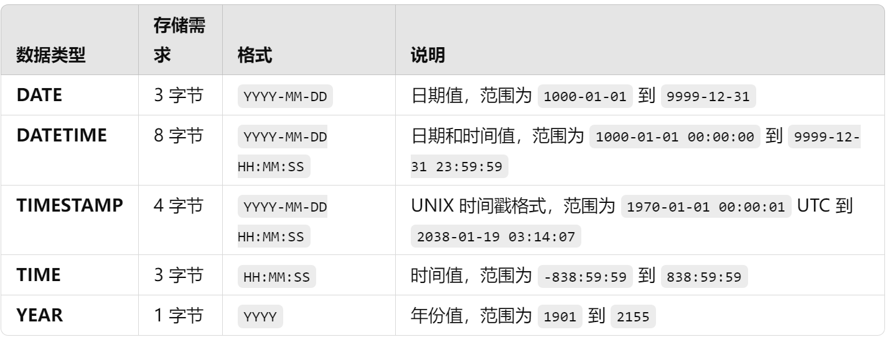

一点扩展：datetime和timestamp类型自动初始化和更新  
- 插入默认的当前时间和修改自动更新当地时间
  ```sql
  crete table t(
    ts timestamp default current_timestamp on update current_timestamp,
    dt datetime default current_timestamp on update current_timestamp
  )
  ```
- 插入默认当前时间
  ```sql
  create table t(
    ts timestamp default current_timestamp,
    dt datetime default current_timestamp
  )
  ```


比如： 
```sql
create table t3(
  t_year year comment '',
  t_time time comment '',
  t_data date comment '',
  t_datetime datetime comment '',
  t_timestamp timestamp comment ''
)
```


>### 表管理：二进制类型（拓）

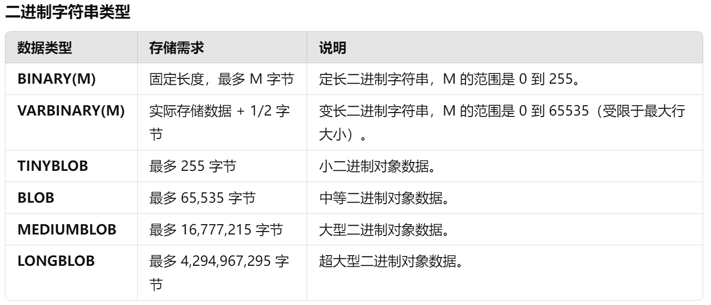


>### 综合练习

```sql
/*DDL_practice_2*/

create database if not exists book_libs_1 character set utf8mb4 collate utf8mb4_0900_as_cs;

use book_libs_1;

create table if not exists student(
  stu_name varchar(10) comment '学生姓名',
  stu_sex char comment '性别',
  stu_age tinyint unsigned comment '年龄',
  stu_height double(4,1) comment '身高',
  stu_birthday date comment '生日',
  stu_register timestamp default current_timestamp comment '注册日期，插入时自动维护，固定为首次插入的时间',
  stu_update timestamp default current_timestamp on update current_timestamp comment '更新日期，插入和修改时自动更新变动的日期'
)
```

[点击返回目录](#mysql笔记)


>### 表管理：修改表

- 修改表中列（字段）  
  - 添加一列（可以指定x字段前或者后）
  ```sql
  ALTER TABLE 表名 ADD 字段名 字段类型;
  ALTER TABLE 表名 ADD 字段名 字段类型 FIRST 字段名;
  ALTER TABLE 表名 ADD 字段名 字段类型 AFTER 字段名;
  ```
  - 修改列名
  ```sql
  ALTER TABLE 表名 CHANGE 原字段名 新字段名 新字段类型;
  ALTER TABLE 表名 CHANGE 原字段名 新字段名 新字段类型 FIRST 字段名;
  #修改名字，并且位置更新到选定字段前

  ALTER TABLE 表名 CHANGE 原字段名 新字段名 新字段类型 AFTER 字段名;
  #修改名字，并且位置更新到选定字段后
  ```
  - 修改列类型
  ```sql
  ALTER TABLE 表名 MODIFY 字段名 新字段类型;
  ALTER TABLE 表名 MODIFY 字段名 新字段类型 [FIRST|AFTER 字段名];
  ```
  - 删除一列
  ```sql
  ALTER TABLE 表名 DROP 字段名;
  ```
- 修改表名
  ```sql
  ALTER TABLE 表名 RENAME 新表名;

  or

  ALTER TABLE 表名 RENAME TO 新表名;
  ```

>### 表管理：删除表

**施主三思啊，删除表和清空表数据都是无法回滚的！！！(除非你备份)**

- 删除数据表
  ```sql
  DROP TABLE 数据表1 [,数据表2,···,数据表n];

  or 

  DROP TABLE IF EXISTS 数据表1 [,数据表2,···,数据表n];
  ```
- 清空表数据
  ```sql
  TRUNCATE TABLE 表名;
  ```


>### 数据定义总练习

```sql
/*DDL——practice_all*/

use ddl_d1;

create table if not exists employees(
  emp_num int comment '',
  last_name varchar(50) comment '',
  first_name varchar(50) comment '',
  mobile varchar(25) comment '',
  emp_code int comment '',
  job_title varchar(50) comment '',
  birth date comment '',
  note varchar(255) comment '',
  sex varchar(5) comment ''
);

# desc employees;

alter table employees change mobile mobile varchar(20) after emp_code;
alter table employees change birth birthday date;
alter table employees modify sex char(1);
alter table employees drop note;
alter table employees add favorite_activity varchar(100);

# desc employees;

alter table employees rename employees_info;

desc employees_info;

show tables;
```

## 数据操作

[点击返回目录](#mysql笔记)


>### 数据操纵语句DML  

1. 插入：关键字"INSERT"
2. 更新：关键字"UPDATE"
3. 删除: 关键字"DELETE"
   
   
数据操作的基本单位：**行**  
按照行进行增删改  

>### 插入数据


- 为表的一行所有字段（列）插入数据
  ```sql
  INSERT INTO 表名 VALUES (value1,value2,......);
  ```
  值列表中需要为表的每一个字段指定值（选中的行有多少数据就有多少个值），并且值得顺序必须和数据表中字段定义时得顺序相同。

- 为表的一行指定字段（列）插入数据-**推荐**
  ```sql
  INSERT INTO 表名(列名1，列名2...) VALUES (value1,value2,...);
  ```
  表名后面指定要插入得列，值列表需要为指定列指定值，并且值的顺序和类型必须和指定的列顺序相同

- 同时插入多条记录
  ```sql
  INSERT INTO 表名 VALUES (value1,value2,...),...,(value1,value2,...);
  ```
  或者
  ```sql
  INSERT INTO 表名(列名1,列名2,...) VALUES (value1,value2,...),...,(value1,value2,...);
  ```
   同样的，顺序要一致

**attention**：  
  字符和日期型的数据应该包含在单引号中。  

example：  
```sql
/*DML_parctice_1*/

create database if not exists dml_d1;

use dml_d1;

create table if not exists students(
  stu_id int comment '学号',
  stu_name varchar(100) comment '姓名',
  stu_age tinyint unsigned comment '年龄',
  stu_birthday date comment '生日',
  stu_height decimal(4,1) default 200 comment '身高'
);

insert into students values (1,'xiao_hei',18,'1990-06-06',185.5);
insert into students(stu_name,stu_age,stu_birthday,stu_height,stu_id) values ('xiao_hunag',18,'1990-06-06',190.9,2);

insert into students (stu_id,stu_name,stu_age) values (3,'xiao_hong',18);

insert into students values (4,'xiao_lv',20,'2022-02-22',176.6),(5,'xiao_lan',20,'2022-02-22',177.6);
insert into students (stu_id,stu_name,stu_age,stu_birthday,stu_height) values (6,'xiao_ming',20,null,null);

SELECT * FROM students; #查询插入的数据
```

>### 修改（更新）数据

- 修改表中所有行数据（全表修改）
  ```sql
  UPDATE 表名 SET column1=value1,column2=value2,...,columnn=valuen;
  ```
  更新表中所有行的指定列数据

- 修改表中符合条件行的数据
  ```sql
  UPDATE 表名 SET column1=value1,column2=value2,...,columnn=valuen WHERE condition;
  ```
  条件修改只是在后面添加where，where指定条件来筛选符合的行进行修改。


example：  
```sql
/*DML_practice_2*/

use dml_d1;

# DELETE FROM students;

INSERT INTO students (stu_id, stu_name, stu_age, stu_birthday, stu_height)
VALUES
(6, '张三', 21, '2002-05-10', 175.5),
(7, '李四', 20, '2003-02-15', 168.0),
(8, '王五', 22, '2001-09-20', 180.2),
(9, '赵六', 19, '2004-03-08', 165.8),
(10, '钱七', 23, '2000-12-01', 172.3),
(11, '孙八', 20, '2003-06-25', 160.5),
(12, '周九', 21, '2002-11-18', 175.0),
(13, '吴十', 22, '2001-04-30', 168.7),
(14, '郑十一', 19, '2004-08-12', 185.5),
(15, '王十二', 23, '2000-07-05', 170.1);


update students set stu_name='黄六' where stu_id=8;

update students set stu_height = stu_height+2 where stu_age<20;
#但是不可以写stu_height+=2,不支持。

update students set stu_birthday='2003-07-10',stu_age=21 where stu_id=11;

update students set stu_age=stu_age+1;

select * from students;
```


>### 删除数据

- 删除表中所有行数据（全表删除）
  ```sql
  DELETE FROM 表名;
  ```

- 删除表中符合条件行的数据（条件删除）
  ```sql
  DELETE FROM 表名 WHERE condition;
  ```

**attention**:  
delete 删除和truncate删除，都会删除表中的全部数据，truncate不仅删除表数据，还会删除数据库id的最大记录值。

example：  
```sql
/*DML_practice_3*/

use dml_d1;

delete from students where stu_age>23;

delete from students where stu_height>200 and stu_id>10;

delete from students where stu_height>200 or stu_id>10;

select * from students;

# delete from students;
```

## 单表数据查询

[点击返回目录](#mysql笔记)

DQL关键字：***SELECT***  

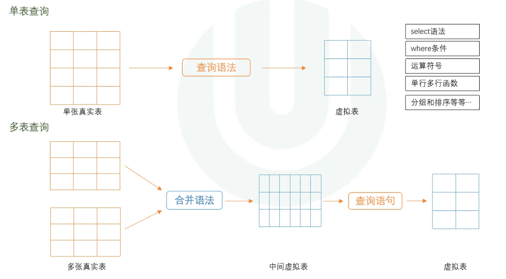

>### 基础SELECT语法  

- 非表查询
  ```sql
  SELECT 1;
  SELECT 9/2;
  SELECT VERSION();
  ```
  相当于java的sout进行输出，而不是查询

- 指定表查询
  ```sql
  SELECT 列名1,列名2,列名3 FROM 表名;

  or

  SELECT 表名.列名, 表名.列名 FROM 表名;

  or

  SELECT 表名.* FROM 表名;
  ```
  指定列，查询表中全部或者某些列。“ 表名.* ”是查询表中全部列，一般用于多表查询。列与列之间使用“,”隔开。  

- 查询列起别名
  ```sql
  SELECT 列名 as 别名, 列名2, 列名3 as 别名 FROM 表名;

  or

  SELECT 列名1 别名, 列名2, 列名3 别名 FROM 表名;
  ```
  查询列可以起别名，as可以省略。起别名的意义主要是简化列名或者对应后期的Java数据属性等。如果别名想要区分大小写，可以添加双引号，比如：“Name”。

- 去除重复行
  ```sql
  SELECT DISTINCT 列名 FROM 表名;

  or

  SELECT DISTINCT 列名1，列名2,... FROM 表名;
  ```
  指定列子去除重复，可以指定单列和多列，但是distinct关键字只写依次并且写在前面。  
  去重，对于单列，如果四个数据两个0两个1，那么输出只会有两个结果0，1  
  对于多列，比如两列，如果有六个数据，其中由0-1；0-0；0-0；1-1；1-1；1-0；那么输出就是0-1；0-0；1-1；1-0；会根据两列组成的向量进行比较。其余依次类推。

- 查询常数
  ```sql
  SELECT 常量 as 列名, 列名, 列名... FROM 表名;
  ```
  select查询可以对常数进行查询，也就是说，在数据库查询出来的数据中增加一个固定的列，这一列数据库中并没有，并且列中的值为我们指定的常量  
  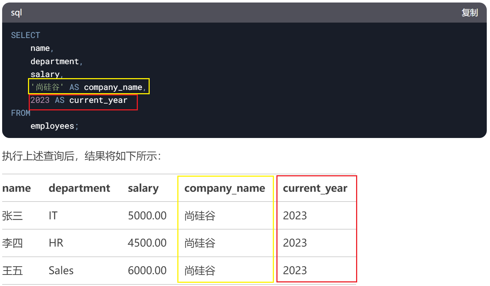

example:  
```sql
/*DQL_practice_1*/
# 一、准备表数据
-- 创建库
CREATE DATABASE IF NOT EXISTS test04_dql;
USE test04_dql;

-- 创建员工表
DROP TABLE IF EXISTS `t_employee`;

CREATE TABLE `t_employee` (
  `eid` INT NOT NULL COMMENT '员工编号',
  `ename` VARCHAR(20) CHARACTER SET utf8mb4 COLLATE utf8mb4_0900_ai_ci NOT NULL COMMENT '员工姓名',
  `salary` DOUBLE NOT NULL COMMENT '薪资',
  `commission_pct` DECIMAL(3,2) DEFAULT NULL COMMENT '奖金比例',
  `birthday` DATE NOT NULL COMMENT '出生日期',
  `gender` ENUM('男','女') CHARACTER SET utf8mb4 COLLATE utf8mb4_0900_ai_ci NOT NULL DEFAULT '男' COMMENT '性别',
  `tel` CHAR(11) CHARACTER SET utf8mb4 COLLATE utf8mb4_0900_ai_ci NOT NULL COMMENT '手机号码',
  `email` VARCHAR(32) CHARACTER SET utf8mb4 COLLATE utf8mb4_0900_ai_ci NOT NULL COMMENT '邮箱',
  `address` VARCHAR(150) DEFAULT NULL COMMENT '地址',
  `work_place` SET('北京','深圳','上海','武汉') CHARACTER SET utf8mb4 COLLATE utf8mb4_0900_ai_ci NOT NULL DEFAULT '北京' COMMENT '工作地点'
) ENGINE=INNODB DEFAULT CHARSET=utf8mb4 COLLATE=utf8mb4_0900_ai_ci;


INSERT  INTO `t_employee`(`eid`,`ename`,`salary`,`commission_pct`,`birthday`,`gender`,`tel`,`email`,`address`,`work_place`) 
VALUES (1,'孙洪亮',28000,'0.65','1980-10-08','男','13789098765','shl@atguigu.com','白庙村西街','北京,深圳'),
(2,'何进',7001,'0.10','1984-08-03','男','13456732145','hj@atguigu.com','半截塔存','深圳,上海'),
(3,'邓超远',8000,NULL,'1985-04-09','男','18678973456','dcy666@atguigu.com','宏福苑','北京,深圳,上海,武汉'),
(4,'黄熙萌',9456,NULL,'1986-09-07','女','13609876789','hxm@atguigu.com','白庙村东街','深圳,上海,武汉'),
(5,'陈浩',8567,NULL,'1978-08-02','男','13409876545','ch888@atguigu.com','回龙观','北京,深圳,上海'),
(6,'韩庚年',12000,NULL,'1985-04-03','男','18945678986','hgn@atguigu.com','龙泽','深圳,上海'),
(7,'贾宝玉',15700,'0.24','1982-08-02','男','15490876789','jby@atguigu.com','霍营','北京,武汉'),
(8,'李晨熙',9000,'0.40','1983-03-02','女','13587689098','lc@atguigu.com','东三旗','深圳,上海,武汉'),
(9,'李易峰',7897,NULL,'1984-09-01','男','13467676789','lyf@atguigu.com','西山旗','武汉'),
(10,'陆风',8789,NULL,'1989-04-02','男','13689876789','lf@atguigu.com','天通苑一区','北京'),
(11,'黄冰茹',15678,NULL,'1983-05-07','女','13787876565','hbr@atguigu.com','立水桥','深圳'),
(12,'孙红梅',9000,NULL,'1986-04-02','女','13576234554','shm@atguigu.com','立城苑','上海'),
(13,'李冰冰',18760,NULL,'1987-04-09','女','13790909887','lbb@atguigu.com','王府温馨公寓','北京'),
(14,'谢吉娜',18978,'0.25','1990-01-01','女','13234543245','xjn@atguigu.com','园中园','上海,武汉'),
(15,'董吉祥',8978,NULL,'1987-05-05','男','13876544333','djx@atguigu.com','小辛庄','北京,上海'),
(16,'彭超越',9878,NULL,'1988-03-06','男','18264578930','pcy@atguigu.com','西二旗','深圳,武汉'),
(17,'李诗雨',9000,NULL,'1990-08-09','女','18567899098','lsy@atguigu.com','清河','北京,深圳,武汉'),
(18,'舒淇格',16788,'0.10','1978-09-04','女','18654565634','sqg@atguigu.com','名流花园','北京,深圳,武汉'),
(19,'周旭飞',7876,NULL,'1988-06-13','女','13589893434','sxf@atguigu.com','小汤山','北京,深圳'),
(20,'章嘉怡',15099,'0.10','1989-12-11','女','15634238979','zjy@atguigu.com','望都家园','北京'),
(21,'白露',9787,NULL,'1989-09-04','女','18909876789','bl@atguigu.com','西湖新村','上海'),
(22,'刘烨',13099,'0.32','1990-11-09','男','18890980989','ly@atguigu.com','多彩公寓','北京,上海'),
(23,'陈纲',13090,NULL,'1990-02-04','男','18712345632','cg@atguigu.com','天通苑二区','深圳'),
(24,'吉日格勒',10289,NULL,'1990-04-01','男','17290876543','jrgl@163.com','北苑','北京'),
(25,'额日古那',9087,NULL,'1989-08-01','女','18709675645','ergn@atguigu.com','望京','北京,上海'),
(26,'李红',5000,NULL,'1995-02-15','女','15985759663','lihong@atguigu.com','冠雅苑','北京'),
(27,'周洲',8000,NULL,'1990-01-01','男','13574528569','zhouzhou@atguigu.com','冠华苑','北京,深圳');

select now();
select version();

select * from t_employee;

select ename,salary from t_employee;

select ename as name, salary from t_employee;
select ename name, salary from t_employee;

select gender from t_employee;
select distinct gender from t_employee;

select ename as name,salary,"china" as "country",2024 as "cur_year" from t_employee;

select * from t_employee;

select *, "base" as "etype" from t_employee;
# 注意，如果出现了*，那么*需要放在第一位！！！

select ename,salary,work_place from t_employee;

select ename,salary as "month_sal",salary*12 as "year_sal" from t_employee;

select ename, salary "month_sal", salary*ifnull(commission_pct,0) "reward",salary+salary*ifnull(commission_pct,0) "total_sal" from t_employee;
#在sql中，null和任何值进行任何运算都是为null
#所以，可以用ifnull函数，第一个是对应的字段，第二个是为null时用于替换的值。来确保结果正确

select distinct salary from t_employee;
```

>### 基础select查询语句  

- 显示表结构
  ```sql
  DESCRIBE 表名;

  or 

  DESC 表名;
  ```

- 条件查询
  ```sql
  SELECT 列名1,列名2,... FROM 表名 WHERE 条件;
  ```

example：  
```sql
/*DQL_practice_2*/

use test04_dql;

desc t_employee;

select * from t_employee where salary>9000;

select ename,salary,salary*12 as "year_sal" from t_employee where salary>20000;

select * from t_employee where salary>8000 and gender="女";
```

>### 运算符的使用  

- `+`、`-`、`*`（加减乘）
- `/` -> 浮点除法 | `DIV` -> 整数除法（取整）
- `%` -> 取模（或者`MOD`）

attention：  
1.运算表达式可以出现在select列位置或者where条件后。  
2.除以零不会报错，结果为null

example：  
```sql
/*DQL_practice_3*/

use test04_dql;

select * from t_employee where (salary+salary*ifnull(commission_pct,0))>20000;

select * from t_employee where (salary-salary*ifnull(commission_pct,0))<8000;

select ename,salary,salary*ifnull(commission_pct,0) from t_employee;

select * from t_employee where eid%2=0;
#可不是eid%2==0，这里不是Java。
```

> ### 比较运算符的使用  

- `>` `>=` `<` `<=`常见的比较  
- `<>` `!=` 两种不等于的表达
- `=` `<=>` 两种等于，第一个是相等运算符，第二个是NULL安全相等运算符
- `IS NULL` `IS NOT NULL` 是或者不是NULL
- `BETWEEN...AND...` `NOT BETWEEN...AND...` 在或者不在值范围内
- `IN()` `NOT IN()` 值在或者不在一组值内
- `LIKE` `NOT LIKE` 简单的模式匹配和否定简单的模式匹配

attention：  
1. 比较的结果为1、0、null，1表示真，0和null表示假
2. 操作适用于数字和字符串，根据需要，字符串会自动转换为数字，数字会自动转换为字符串，不需要考虑类型。比如：'1'=1 是真
3. between...and...是一个闭区间
4. `LIKE` `NOT LIKE` 通常和通配符一起使用，常见的通配符有：
   - `%` 表示零个或者多个字符
   - `_` 表示一个单一字符 
   - example： 
    ```sql
    SELECT * FROM employees WHERE first_name LIKE 'A%';
    # 返回 first_name 以 "A" 开头的所有记录。

    or

    SELECT * FROM employees WHERE first_name LIKE '%on%';
    # 返回 first_name 中包含 "on" 的所有记录

    or

    SELECT * FROM employees WHERE first_name LIKE '____e';
    # 返回 first_name 长度为5个字符且以 "e" 结尾的所有记录
    ```

example:  
```sql
/*DQL_practice_4*/

use test04_dql;

select * from t_employee where eid=1;
select * from t_employee where eid='1';

select * from t_employee where salary>5000;

select * from t_employee where commission_pct is not null;
select * from t_employee where commission_pct is null;
select * from t_employee where commission_pct <=> null;

select * from t_employee where birthday between '1990-01-01' and '1995-01-01';

select * from t_employee where gender='女';

select * from t_employee where tel like '138%';

select * from t_employee where email like '%@163.com';

select * from t_employee where address is null;

select * from t_employee where work_place in ('上海','北京','深圳');

select * from t_employee where ename like '陈%';

select * from t_employee where birthday not between '1990-01-01' and '1995-01-01';

select * from t_employee where gender != '男';

select * from t_employee where eid%2=1;
```

> ### 逻辑运算符的使用    

- `AND` `&&` 
- `NOT` `!` 
- `OR` `||`
- `XOR` 异或运算 **(同为0，不同为1)**  
  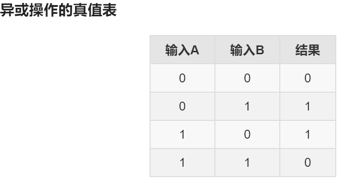
- `IN`
  ```sql
  check (gender in ('male','female'));
  ```

attention：  
MySQL把任何非零、非null的值记为true  

example： 
```sql
/*DQL_practice_5*/

use test04_dql;

select * from t_employee where salary>5000 and work_place like '%北京%';
# find_in_set('值',列名) -> 返回布尔值，1有0无
select * from t_employee where salary>5000 and find_in_set('北京',work_place);

select * from t_employee where commission_pct is null or address is null;

select * from t_employee where birthday < '1985-01-01' or salary<4000;

select * from t_employee where gender='男' and find_in_set('上海',work_place)=0;

select * from t_employee where salary>6000 or email like '%@gmail.com';

select * from t_employee where salary<4500 and find_in_set('上海',work_place)=0;

select * from t_employee where eid%2=0 and address is not null;

select * from t_employee where gender='女' or salary<=5500;

select * from t_employee where salary>5000 and (find_in_set('上海',work_place)=1 or find_in_set('北京',work_place)=1);

select * from t_employee where ename like '%b%' and address is null;
```

> ### 运算符的优先级   

优先级高的运算符会先于优先级低的运算符执行。图中由上往下，优先级由高到低。

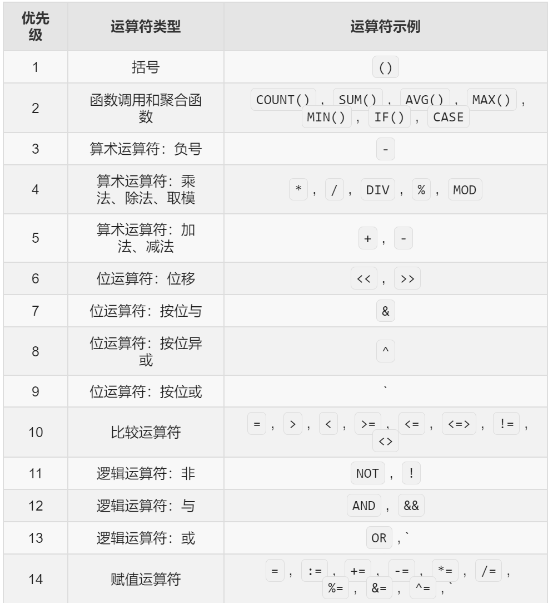

[点击返回目录](#mysql笔记)


> ### 自定义函数(拓)  

可以自己编写函数；进行查询操作  
```sql
CREATE FUNCTION function_name (
    param1 type1,
    param2 type2,
    ...
)
RETURNS return_type
BEGIN
    -- 函数体
    -- 可以包含变量声明、逻辑操作、条件语句等
    RETURN return_value;
END;
```

example:  
```sql
DELIMITER //

CREATE FUNCTION CalculateAge(birthdate DATE) 
RETURNS INT
DETERMINISTIC
BEGIN
    DECLARE age INT;
    SET age = TIMESTAMPDIFF(YEAR, birthdate, CURDATE());
    RETURN age;
END;
//

DELIMITER ;

SELECT CalculateAge('2000-01-01') AS Age;
# 调用自定义函数

CREATE TABLE Users (
    id INT AUTO_INCREMENT PRIMARY KEY,
    name VARCHAR(50),
    birthdate DATE
);

INSERT INTO Users (name, birthdate) 
VALUES 
    ('Alice', '1995-06-15'),
    ('Bob', '2002-11-20'),
    ('Charlie', '1988-03-05');

SELECT name,birthdate,CalculateAge(birthdate) AS Age FROM Users;
```
在 MySQL 中，`DELIMITER` 命令用于更改 SQL 语句的结束符。默认情况下，SQL 语句以分号 (`;`) 作为结束符。当定义存储过程、函数或触发器时，语句可能包含多个分号，这会导致 MySQL 提前结束语句解析。通过 `DELIMITER`，可以临时更改结束符，以便正确解析这些复杂语句。  
`DELIMITER //` 命令告诉 MySQL，当前 SQL 块的结束符是 `//`。定义函数完成后，通过 `DELIMITER ;` 恢复默认分号作为结束符。

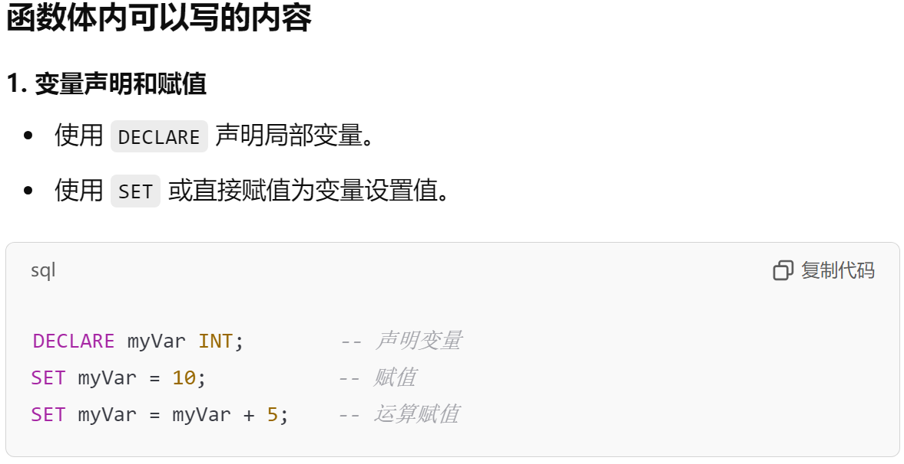
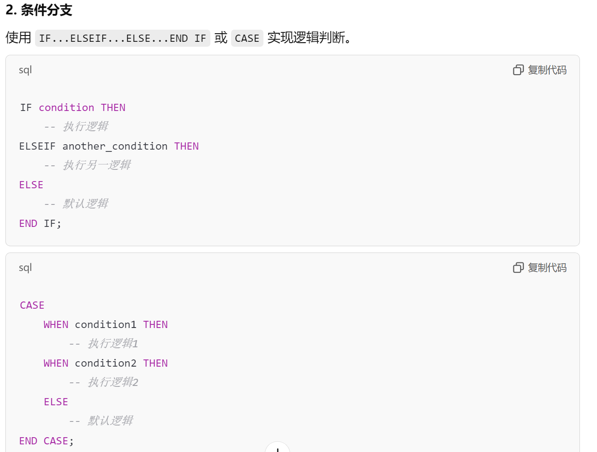
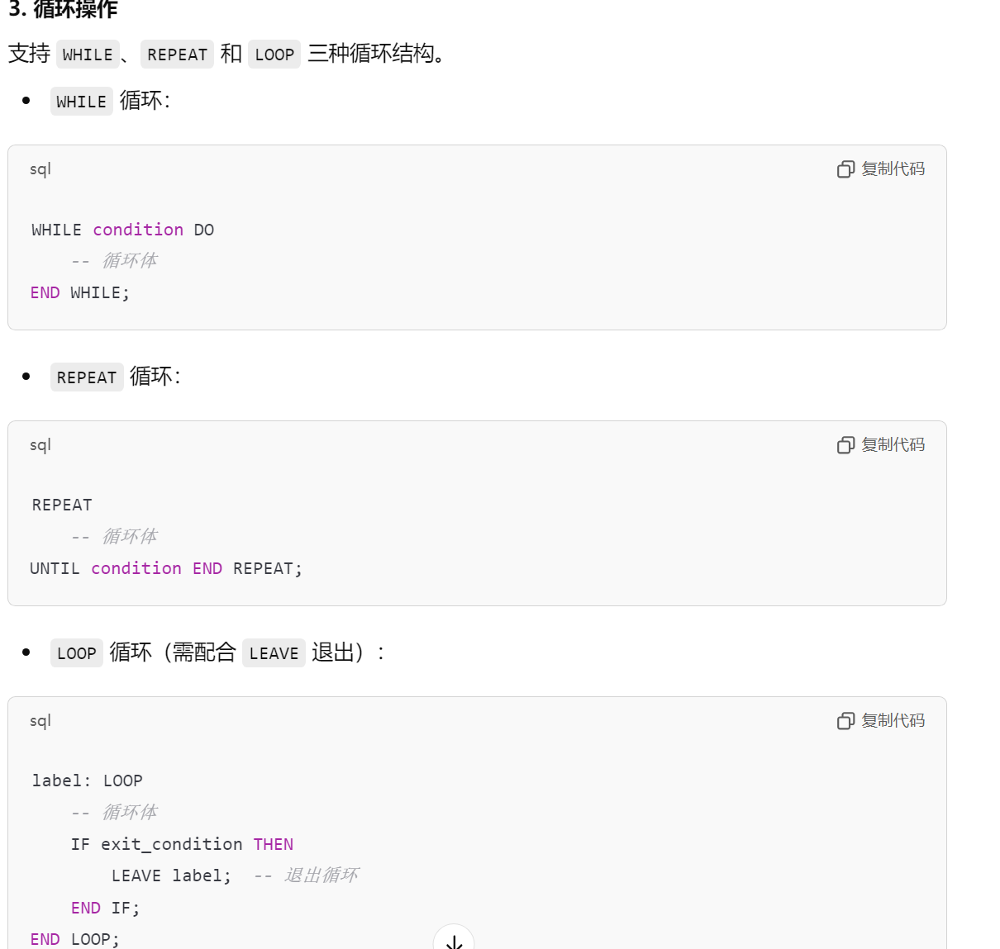
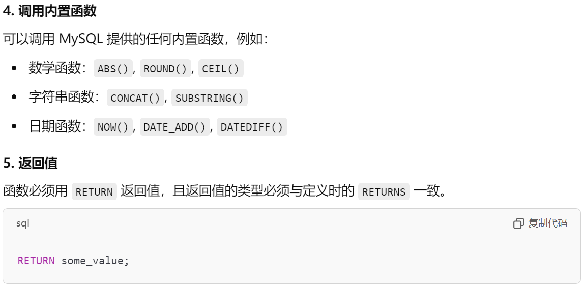


[点击返回目录](#mysql笔记)


> ### 单行和多行函数   

**单行函数**：对一行中的某列操作的函数，返回结果是单一值。  
**多行函数**：对多行中的某列操作的函数，返回结果是单一值。   

#### <span style="color: orange">数值函数</sapn>

| 函数名      | 功能描述                             | 示例                            | 返回值                 |
| ----------- | ------------------------------------ | ------------------------------- | ---------------------- |
| ABS(x)      | 返回数值 `x` 的绝对值                | `SELECT ABS(-10);`              | `10`                   |
| CEIL(x)     | 返回大于或等于 `x` 的最小整数        | `SELECT CEIL(4.2);`             | `5`                    |
| FLOOR(x)    | 返回小于或等于 `x` 的最大整数        | `SELECT FLOOR(4.8);`            | `4`                    |
| ROUND(x, d) | 将数值 `x` 四舍五入到 `d` 位小数     | `SELECT ROUND(4.567, 2);`       | `4.57`                 |
| TRUNCATE(x, d) | 将数值 `x` 截断到 `d` 位小数,不会四舍五入         | `SELECT TRUNCATE(4.567, 2);`       | `4.56`                 |
| MOD(x, y)   | 返回 `x` 除以 `y` 的余数             | `SELECT MOD(10, 3);`            | `1`                    |
| POWER(x, y) | 返回 `x` 的 `y` 次幂                 | `SELECT POWER(2, 3);`           | `8`                    |
| SQRT(x)     | 返回数值 `x` 的平方根                | `SELECT SQRT(16);`              | `4`                    |
| EXP(x)      | 返回自然对数的底数 `e` 的 `x` 次幂   | `SELECT EXP(1);`                | `2.718281828459045`    |
| LN(x)       | 返回数值 `x` 的自然对数              | `SELECT LN(2.718281828459045);` | `1`                    |
| LOG(x, y)   | 返回以 `x` 为底 `y` 的对数           | `SELECT LOG(2, 8);`             | `3`                    |
| SIN(x)      | 返回数值 `x` 的正弦值                | `SELECT SIN(0);`                | `0`                    |
| COS(x)      | 返回数值 `x` 的余弦值                | `SELECT COS(0);`                | `1`                    |
| TAN(x)      | 返回数值 `x` 的正切值                | `SELECT TAN(0);`                | `0`                    |
| ASIN(x)     | 返回数值 `x` 的反正弦值              | `SELECT ASIN(1);`               | `1.5707963267948966`   |
| ACOS(x)     | 返回数值 `x` 的反余弦值              | `SELECT ACOS(1);`               | `0`                    |
| ATAN(x)     | 返回数值 `x` 的反正切值              | `SELECT ATAN(1);`               | `0.7853981633974483`   |
| DEGREES(x)  | 将弧度转换为角度                     | `SELECT DEGREES(PI());`         | `180`                  |
| RADIANS(x)  | 将角度转换为弧度                     | `SELECT RADIANS(180);`          | `3.141592653589793`    |
| PI()        | 返回圆周率 `π` 的值                  | `SELECT PI();`                  | `3.141592653589793`    |
| RAND()      | 返回一个介于 0 和 1 之间的随机浮点数. | `SELECT RAND();`                | `0.123456789` (随机值) |

attention:  
`RAND()`是伪随机，如果括号内值相同，那么随机出来的结果就相同。


#### <span style="color: orange">字符串函数</sapn>

| 函数名                      | 功能描述                                                                       | 示例                                             | 返回值        |
| --------------------------- | ------------------------------------------------------------------------------ | ------------------------------------------------ | ------------- |
| CONCAT(s1, s2, ...)         | 将多个字符串连接成一个字符串                                                   | `SELECT CONCAT('Hello', ' ', 'World');`          | `Hello World` |
| LENGTH(s)                   | 返回字符串 `s` 的长度（字符数）                                                | `SELECT LENGTH('Hello');`                        | `5`           |
| CHAR_LENGTH(s)              | 返回字符串 `s` 的字符数（与 `LENGTH` 类似）                                    | `SELECT CHAR_LENGTH('Hello');`                   | `5`           |
| LOWER(s)                    | 将字符串 `s` 转换为小写                                                        | `SELECT LOWER('HELLO');`                         | `hello`       |
| UPPER(s)                    | 将字符串 `s` 转换为大写                                                        | `SELECT UPPER('hello');`                         | `HELLO`       |
| SUBSTRING(s, start, length) | 从字符串 `s` 的 `start` 位置开始，截取 `length` 长度的子字符串                 | `SELECT SUBSTRING('Hello World', 7, 5);`         | `World`       |
| LEFT(s, length)             | 从字符串 `s` 的左边开始，截取 `length` 长度的子字符串                          | `SELECT LEFT('Hello World', 5);`                 | `Hello`       |
| RIGHT(s, length)            | 从字符串 `s` 的右边开始，截取 `length` 长度的子字符串                          | `SELECT RIGHT('Hello World', 5);`                | `World`       |
| TRIM(s)                     | 去除字符串 `s` 两端的空格                                                      | `SELECT TRIM(' Hello ');`                        | `Hello`       |
| LTRIM(s)                    | 去除字符串 `s` 左端的空格                                                      | `SELECT LTRIM(' Hello ');`                       | `Hello `      |
| RTRIM(s)                    | 去除字符串 `s` 右端的空格                                                      | `SELECT RTRIM(' Hello ');`                       | ` Hello`      |
| REPLACE(s, old, new)        | 将字符串 `s` 中的 `old` 替换为 `new`                                           | `SELECT REPLACE('Hello World', 'World', 'SQL');` | `Hello SQL`   |
| INSTR(s, substring)         | 返回子字符串 `substring` 在字符串 `s` 中第一次出现的位置                       | `SELECT INSTR('Hello World', 'World');`          | `7`           |
| LPAD(s, length, pad)        | 用字符串 `pad` 从左边填充字符串 `s`，使其长度达到 `length`                     | `SELECT LPAD('123', 5, '0');`                    | `00123`       |
| RPAD(s, length, pad)        | 用字符串 `pad` 从右边填充字符串 `s`，使其长度达到 `length`                     | `SELECT RPAD('123', 5, '0');`                    | `12300`       |
| REVERSE(s)                  | 反转字符串 `s`                                                                 | `SELECT REVERSE('Hello');`                       | `olleH`       |
| POSITION(substring IN s)    | 返回子字符串 `substring` 在字符串 `s` 中第一次出现的位置                       | `SELECT POSITION('World' IN 'Hello World');`     | `7`           |
| ASCII(s)                    | 返回字符串 `s` 中第一个字符的 ASCII 码值                                       | `SELECT ASCII('A');`                             | `65`          |
| CHAR(n)                     | 返回 ASCII 码值 `n` 对应的字符                                                 | `SELECT CHAR(65);`                               | `A`           |
| FIND_IN_SET(str, strlist)   | 返回字符串 `str` 在逗号分隔的字符串列表 `strlist` 中第一次出现的位置，如果找不到则返回 0 | `SELECT FIND_IN_SET('b', 'a,b,c,d');`            | `2`           |

#### <span style="color: orange">时间类函数</sapn>

| 函数名                                    | 功能描述                                               | 示例                                                                        | 返回值                |
| ----------------------------------------- | ------------------------------------------------------ | --------------------------------------------------------------------------- | --------------------- |
| NOW()                                     | 返回当前日期和时间                                     | `SELECT NOW();`                                                             | `2023-10-05 12:34:56` |
| CURRENT_DATE()                            | 返回当前日期                                           | `SELECT CURRENT_DATE();`                                                    | `2023-10-05`          |
| CURRENT_TIME()                            | 返回当前时间                                           | `SELECT CURRENT_TIME();`                                                    | `12:34:56`            |
| CURRENT_TIMESTAMP()                       | 返回当前日期和时间（与 `NOW()` 类似）                  | `SELECT CURRENT_TIMESTAMP();`                                               | `2023-10-05 12:34:56` |
| DATE(datetime)                            | 从日期时间值中提取日期部分                             | `SELECT DATE('2023-10-05 12:34:56');`                                       | `2023-10-05`          |
| TIME(datetime)                            | 从日期时间值中提取时间部分                             | `SELECT TIME('2023-10-05 12:34:56');`                                       | `12:34:56`            |
| YEAR(date)                                | 从日期值中提取年份                                     | `SELECT YEAR('2023-10-05');`                                                | `2023`                |
| MONTH(date)                               | 从日期值中提取月份                                     | `SELECT MONTH('2023-10-05');`                                               | `10`                  |
| DAY(date)                                 | 从日期值中提取天数                                     | `SELECT DAY('2023-10-05');`                                                 | `5`                   |
| HOUR(time)                                | 从时间值中提取小时                                     | `SELECT HOUR('12:34:56');`                                                  | `12`                  |
| MINUTE(time)                              | 从时间值中提取分钟                                     | `SELECT MINUTE('12:34:56');`                                                | `34`                  |
| SECOND(time)                              | 从时间值中提取秒数                                     | `SELECT SECOND('12:34:56');`                                                | `56`                  |
| DATE_ADD(date, INTERVAL expr unit)        | 将日期 `date` 加上指定的时间间隔 `expr`                | `SELECT DATE_ADD('2023-10-05', INTERVAL 1 DAY);`                            | `2023-10-06`          |
| DATE_SUB(date, INTERVAL expr unit)        | 将日期 `date` 减去指定的时间间隔 `expr`                | `SELECT DATE_SUB('2023-10-05', INTERVAL 1 DAY);`                            | `2023-10-04`          |
| DATEDIFF(date1, date2)                    | 返回两个日期之间的天数差                               | `SELECT DATEDIFF('2023-10-05', '2023-10-01');`                              | `4`                   |
| TIMESTAMPDIFF(unit, datetime1, datetime2) | 返回两个日期时间之间的差值，单位为 `unit`              | `SELECT TIMESTAMPDIFF(HOUR, '2023-10-05 12:00:00', '2023-10-05 14:00:00');` | `2`                   |
| DATE_FORMAT(date, format)                 | 将日期 `date` 格式化为指定的字符串格式                 | `SELECT DATE_FORMAT('2023-10-05', '%Y-%m-%d');`                             | `2023-10-05`          |
| TIME_FORMAT(time, format) | 将时间 `time` 格式化为指定的字符串格式 | `SELECT TIME_FORMAT('12:34:56', '%H:%i:%s');` | `12:34:56` |
| STR_TO_DATE(str, format)                  | 将字符串 `str` 按照指定的格式 `format` 转换为日期时间  | `SELECT STR_TO_DATE('2023-10-05 12:34:56', '%Y-%m-%d %H:%i:%s');`           | `2023-10-05 12:34:56` |
| WEEK(date)                                | 返回日期 `date` 是一年中的第几周                       | `SELECT WEEK('2023-10-05');`                                                | `40`                  |
| QUARTER(date)                             | 返回日期 `date` 是一年中的第几季度                     | `SELECT QUARTER('2023-10-05');`                                             | `4`                   |
| DAYOFWEEK(date)                           | 返回日期 `date` 是一周中的第几天（1=星期日，7=星期六） | `SELECT DAYOFWEEK('2023-10-05');`                                           | `5`                   |
| DAYOFYEAR(date)                           | 返回日期 `date` 是一年中的第几天                       | `SELECT DAYOFYEAR('2023-10-05');`                                           | `278`                 |
| SUBTIME(time1,time2) | 返回`time1`减去`time2`后的时间 | `SELECT SUBTIME('2023-10-05 12:34:56', '01:00:00');` | `2023-10-05 11:34:56` |
| ADDTIME(time1,time2) | 返回`time1`加上`time2`后的时间 | `SELECT ADDTIME('2023-10-05 12:34:56', '01:00:00');` | `2023-10-05 13:34:56` |


example：  
```sql
/*DQL_time_function_parctice*/

use test04_dql;

select * from t_employee where day(birthday)=day(now()) and month(birthday)=month(now());
select * from t_employee where date_format(birthday,'%m-%d')=date_format(now(),'%m-%d');

select * from t_employee where month(birthday)=month(now());

select * from t_employee where month(birthday)=(month(now())+1)%12;

select ename,salary, round(datediff(now(),birthday)/365,0) as age from t_employee; 

select * from t_employee where round(datediff(now(),birthday)/365,0) between 25 and 35;
```

#### <span style="color: orange">流程控制函数</sapn>

| 函数名                      | 功能描述                                               | 示例                                                 | 返回值    |
| --------------------------- | ------------------------------------------------------ | ---------------------------------------------------- | --------- |
| CASE                        | 根据多条件执行不同的操作。case开头，end结尾                                 | `SELECT CASE WHEN 1=1 THEN 'True' ELSE 'False' END;` | `True`    |
| IF(condition, true_val, false_val)     | 如果 `condition` 为真，返回 `true_val`，否则返回 `false_val`      | `SELECT IF(1=1, 'True', 'False');`                   | `True`    |
| IFNULL(expr1, expr2)        | 如果 `expr1` 为 NULL，返回 `expr2`，否则返回 `expr1`   | `SELECT IFNULL(NULL, 'Default');`                    | `Default` |
| NULLIF(expr1, expr2)        | 如果 `expr1` 等于 `expr2`，返回 NULL，否则返回 `expr1` | `SELECT NULLIF(1, 1);`                               | `NULL`    |
| COALESCE(expr1, expr2, ...) | 返回第一个非 NULL 的表达式                             | `SELECT COALESCE(NULL, NULL, 'Default', 'Other');`   | `Default` |

example：  
```sql
/*DQL_control_function_parctice*/

use test04_dql;

select ename,salary,birthday,if(year(birthday)>1990,round(salary*1.05,1),round(salary*1.1,1)) as newSal from t_employee;

select eid,ename,if(gender='男','man','woman') as type from t_employee;

select ename,salary,truncate(salary*ifnull(commission_pct,0),1) as reward from t_employee;

select ename,gender,commission_pct,
			case
      	when gender='男' then 2000*ifnull(commission_pct,0.1)
        when gender='女' then 3000*ifnull(commission_pct,0.1)
        else 0
      end as '补助金' from t_employee;

select ename,gender,commission_pct,
			case gender
      	when '男' then 2000*ifnull(commission_pct,0.1)
        when '女' then 3000*ifnull(commission_pct,0.1)
        else 0
      end as '补助金' from t_employee;
```

> #### <span style='color:orange'>多行函数（聚合函数）</span>  

| 聚合函数          | 作用                                         | 示例                                                                               |
| ----------------- | -------------------------------------------- | ---------------------------------------------------------------------------------- |
| `COUNT(*/列名)`           | 计算行数(`*`)或列中非空值的数量(`列名`)                       | `SELECT COUNT(*) FROM table_name;`                                                 |
| `SUM`             | 计算指定列的数值总和                         | `SELECT SUM(column_name) FROM table_name;`                                         |
| `AVG`             | 计算指定列的平均值                           | `SELECT AVG(column_name) FROM table_name;`                                         |
| `MAX`             | 返回指定列的最大值                           | `SELECT MAX(column_name) FROM table_name;`                                         |
| `MIN`             | 返回指定列的最小值                           | `SELECT MIN(column_name) FROM table_name;`                                         |
| `GROUP_CONCAT`    | 将组中的值连接成一个字符串（某些数据库支持） | `SELECT GROUP_CONCAT(column_name) FROM table_name;`                                |
| `STDDEV`          | 计算标准偏差                                 | `SELECT STDDEV(column_name) FROM table_name;`                                      |
| `VARIANCE`        | 计算方差                                     | `SELECT VARIANCE(column_name) FROM table_name;`                                    |
| `MEDIAN`          | 计算中位数（某些数据库支持）                 | `SELECT MEDIAN(column_name) FROM table_name;`                                      |
| `PERCENTILE_CONT` | 计算连续分位数（适用于窗口函数）             | `SELECT PERCENTILE_CONT(0.5) WITHIN GROUP (ORDER BY column_name) FROM table_name;` |

attention:  
聚合函数不能嵌套使用！  
聚合函数碰到null时，不计数，不处理，不关注。  

example:   
```sql
/*DQL_multiple_function_practice*/

use test04_dql;

select round(avg(salary),1),min(salary),max(salary),sum(salary) from t_employee;

select max(birthday) as 'oldest',min(birthday) as 'youngest' from t_employee;

select count(*) as 'total_emp',count(1) as 'total_emp_1',count(commission_pct) as 'emp_has_reward' from t_employee;
```
[点击返回目录](#mysql笔记)

> ### 高级查询处理   

> #### <span style='color:orange'>分组查询</sapm>

先将数据行按照某一或者多个特性列进行分组，最后查询**每组**的特性  
分组查询的结果只能是分组特性列或者聚合函数  

基础语法：  
```sql
SELECT 分组列,分组列,聚合函数 FROM 表名 [WHERE 条件] [GROUP BY 分组列,分组列... HAVING 分组后的条件]
```
attention：  
- where和group by同级，group by可以单独出现，但是having只能跟着group by出现  
- `GROUP BY`：把数据分组，每组汇总计算。
- `HAVING`：对分组后的汇总结果进行筛选。
- `WHERE` 和 `HAVING` 的区别：
`WHERE` 作用在原始数据，分组前过滤。
`HAVING` 作用在汇总数据，分组后过滤。  
 
example:   
```sql
/*DQL_group_by_practice*/

use test04_dql;

select gender, count(*),round(avg(salary),1) from t_employee group by gender;

select year(birthday),gender,count(*),round(avg(salary),1) as 'avg_sal' from t_employee group by year(birthday),gender;
# 查询出生年份和性别相同的人的平均工资

select gender,count(*),round(avg(salary),1) from t_employee where salary>5000 group by gender;
# 先找出工资大于5000的，在进行分组计算查询

select gender,count(*),round(avg(salary),1) from t_employee group by gender having round(avg(salary),1)>11500;

select gender,count(*),round(avg(salary),1) as 'avg_sal' from t_employee group by gender having avg_sal>11500;
# having可以利用别名来判断，但是where不可以，这与执行顺序有关
```

> #### <span style='color:orange'>排序查询</sapm>
 
按照某一、或者多个特性列进行数据排序，不会影响结果条数，知识改变结果排序   

基础语法：
```sql
SELECT 列名,列名,函数 FROM 表名 [WHERE 条件] [ORDER BY 排序列 ASC|DESC, 排序列 ASC|DESC...]

# 其中，ASC表示正序排列（默认值）
# DESC表示倒序
```
attention：   
- 多行排序时，只有第一列相同，第二列才会生效，以此类推   
- order by和where是同级的

example：   
```sql
/*DQL_sort_practice*/

use test04_dql;

select * from t_employee order by birthday;
select * from t_employee order by birthday desc;

select * from t_employee order by salary desc;

select * from t_employee order by salary desc,birthday desc;

select * from t_employee where commission_pct is not null order by salary desc;
```

> #### <span style='color:orange'>分页查询（数据切割）</span>


将结果进行分页切割，按照指定的区域一段一段的进行展示   

基础语法：   
```sql
SELECT 列,列,函数 FROM 表名 [WHERE 条件] [LIMIT [位置偏移量,] 行数]

# 位置偏移量：可选参数，不写默认为0，代表不偏移。代表了从哪一条数据开始查询   
# 行数：指示返回的记录条数，同时也是每页显示的数据条数
```

attention：   
limit 必须放在整个select语句的最后面   

**分页公式**：   
前端给到‘page（第几页）’和‘size（页面条数）’后，后端查询  
`limit (page-1)*size,size`


example：   
```sql
/*DQL_page_select_practice*/

use test04_dql;

# 查询工资最高的员工信息
select * from t_employee order by salary desc limit 0,1;

# 查询工资第二高
select * from t_employee order by salary desc limit 1,1;

# 查询工资最高的女性员工工资
select * from t_employee where gender='女' order by salary desc limit 0,1;
```

> ### 查询关键字的顺序   

关键字的顺序不可以颠倒
```sql
SELECT -> FROM -> WHERE ->GROUP BY -> HAVING -> ORDER BY -> LIMIT...
```

***select语句的执行顺序***   
```sql
FROM -> WHERE -> GROUP BY -> HAVING -> SELECT -> DISTINCT -> ORDER BY -> LIMIT
```

> ### 综合训练   

```sql
/*DQL_comprehensive_practice*/

create database if not exists test04_lib;

use test04_lib;

create table if not exists books(
  id int comment '书编码',
  name varchar(50) comment '书名',
  authors varchar(100) comment '作者',
  price float comment '价格',
  pubdate year comment '出版日期',
  note varchar(100) comment '说明',
  num int comment '库存'
);

insert into books values
  (1,'Tal of AAA','Dickes',23,1995,'novel',11),
  (2,'EmmaT','Jane lura',35,1993,'joke',22),
  (3,'Story of Jane','Jane Tim',40,2001,'novel',0),
  (4,'Lovey Day','Georage Byron',20,2005,'novel',30),
  (5,'Old Land','Honore Blade',30,2010,'law',0),
  (6,'The Battle','Upton Sara',30,1999,'medicine',40),
  (7,'Rose Hood','Richard haggard',28,2008,'cartoon',28);
  
select * from books;
# delete from books;

# 将小说类型的书价格都增加5
update books set price=price+5 where note='novel';

# 讲名称为EmmaT的数价格改为40，并且将说明改为drama
update books set price=40,note='drama' where name='EmmaT';

# 删除库存为0的记录
delete from books where num=0;

# 统计书名中包含a字母的书
select count(name) from books where name like '%a%';

# 统计书名中包含a字母的书的数量和库存总数
select count(name) as 'name_has_a',sum(num) as 'total_num' from books where name like '%a%';

# 找出novel类型的书，按照价格降序排列
select * from books where note='novel' order by price desc;

# 查询图书信息，按照库存量降序排序，如果相同按照note排序
select * from books order by num desc,note;

# 按照note分类统计书的数量
select note,count(*) from books group by note;

# 按照note分类同级书的库存量，显示库存超过30本的
select note,sum(num) from books group by note having sum(num)>=30;

# 查询所有图书，每页显示5本，显示第二页
select * from books limit 5,5;

# 按照note分类统计书的库存量，显示库存最多的
select note,sum(num) from books group by note order by sum(num) desc limit 0,1;

# 查询书名达到10个字符的书，不包括其中的空格
select * from books where length(replace(name,' ',''))>=10;

# 查询书名和类型
select name,case 
		      when note='novel' then '小说'
              when note='law' then '法律'
              when note='medicine' then '医药'
              when note='cartoon' then '卡通'
              when note='joke' then '笑话'
            end as type from books;

# 查询书名、库存、其中num超过30显示滞销，大于0小于10显示畅销，0显示无货
select name,num,case 
				  when num>30 then '滞销'
                  when num between 0 and 10 then '畅销'
                  when num=0 then '无货'
                  else '正常'
                end as state from books;
                
# 统计每一种note的库存量，并合计总量
# WITH ROLLUP：生成一个额外的合计行，这行显示所有分类的总和。
# 注意，这一行中的 note 值为 NULL，表示这是合计行
# 可以用ifnull来更改显示
select ifnull(note,'total'),sum(num) from books group by note with rollup;

# 统计每一种note的数量，并合计总量
select ifnull(note,'total'),count(*) from books group by note with rollup;

# 统计库存量前三名的图书
select * from books order by num desc limit 0,3;

# 找出最早出版的一本书
select * from books order by pubdate limit 0,1;

# 找出novel中价格最高的一本书
select * from books order by price desc limit 0,1;

# 找出书名中字数最多的一本书，不含空格
select * from books order by length(replace(name,' ','')) desc limit 0,1;
```


> ## 数据约束

[点击返回目录](#mysql笔记)

- **约束概念**：表级别的规定，数据的限制语法   
- **约束作用**：确保数据的准确、可靠。   
- **添加时机**：1. 创建表时直接添加；2.创建后用alter table添加   

> ### 约束分类   

> #### <span style='color:orange'>列级约束</span>

列级约束是直接定义在单个列上的约束，用于限制该列的数据。它通常在创建表时和列定义一起指定。此类约束只对当前列有效果   

常见：   
- `NOT NULL`:非空约束
  - 默认：所有类型列默认都可以为null，包括数字类型
  - 非空约束只能添加到列上
  - 一个表中可以有很多行进行非空限定
  - 空字符串、0都不是空，空是null
  - 基础语法：
    ```sql
    建表添加：

    create table name(
        ...
        字段名 数据类型 NOT NULL,
        ...
    );

    建表后修改：

    alter table 表名 modify 字段名 数据类型 not null;

    删除：
    alter table 表名 modify 字段名 数据类型;
    ```
- `DEFAULT`:某列的默认值
  - 默认值约束不能添加到唯一或者主键上，其他列都可以
  - 当插入数据时，没有显式赋值，就赋予默认值。如果主动插入null，也不会赋予默认值，会赋值null。
  - 默认值需要对应正确的数据类型
  - 基础语法
    ```sql
    建表时添加：

    create table name(
      ...,
      字段名 数据类型 default 默认值,
      字段名 数据类型 not null default 默认值,
      ...
    );

    建表后修改：

    alter table 表名 modify 字段名 数据类型 default 默认值;
    alter table 表名 modify 字段名 数据类型 not null default 默认值;

    删除默认值(不指定就是取消)：

    alter table 表名 modify 字段名 数据类型;
    ```
- `CHECK`:检查约束，可以用于自定义约束   
  - 8.0+版本才支持
  - check（表达式），可以自定义表达式编程任何约束。
  - 不是很推荐check约束建议程序级限制,在代码部分进行判断
  - 基础语法：
    ```sql
    建表时添加：

    create table name(
      字段名 数据类型,
      check(表达式),
      # check约束实际上属于表级别，所以不需要添加到列后面，单独成行
      # 建表时可以不指定约束名，MySQL会自己生成一个名字，可以利用后面的指令查看。
      ...
    );

    建表后修改：

    alter table 表名 add constraint 约束名 check(表达式);
    # 约束名同一表内不可以重复

    删除约束：

    alter table 表名 drop constraint 约束名;

    查看check约束（特殊）：

    select * from INFORMATION_SCHEMA.TABLE_CONSTRAINTS where TABLE_SCHEMA='数据库名' and TABLE_NAME='表名';
    # 注意`INFORMATION_SCHEMA`后面是`.`,而不是逗号！！！
    ```

example： 
```sql
/*Column-Level Constraint*/

create database if not exists test05_constraint;
use test05_constraint;

/*非空约束*/
create table empl(
  e_name varchar(50) not null,
  e_age int
);

desc empl;

alter table empl modify e_age int not null;
# 删除not null -> 不指定那么默认就是可以null
alter table empl modify e_name varchar(50);

/*默认值约束*/
create table if not exists emp2(
  name varchar(20) default 'xiaohei',
  age int not null default 0
);
desc emp2;
# 修改
alter table emp2 modify age int default 18 not null;
# 删除
alter table emp2 modify name varchar(20);

/*check约束*/
create table if not exists emp3(
  gender char,
  check (gender in ('男','女')),
  age int
);
desc emp3;
# 修改
alter table emp3 add constraint age_check check(age>18);
# 查看check约束
select * from INFORMATION_SCHEMA.TABLE_CONSTRAINTS 
where TABLE_SCHEMA='test05_constraint' and TABLE_NAME='emp3';
# 删除
alter table emp3 drop constraint age_check;
```

[点击返回目录](#mysql笔记)


> #### <span style='color:orange'>行级约束</span>

行级约束是定义在表级别的约束，适用于整行数据，通常用于定义涉及多个列的约束，比如复合主键和外键。需要对比同一个表中其他行数据才可以有效果   

常见：   
- `PRIMARY KEY`:主键唯一并且不可以为空
  - 主键（Primary Key）是一种特殊的约束，用于唯一标识表中的每一行记录。可以是任意类型。
  - 主键列中的每个值必须是唯一的，不能重复。
  - 主键列不能包含 NULL 值
  - 数据库会自动为主键列创建索引，以提高查询性能。
  - 主键可以由单个列构成，也可以由多个列组合构成（称为复合主键）。
  - 基础语法：
    ```sql
    建表时添加：

    create table name(
      字段名 数据类型 primary key,
      # 列级模式
    );

    create table name(
      字段名 数据类型,
      [constrain 约束名] primary key(字段名)
      # 表级模式
    );

    建表后修改：

    alter table 表名 add primary key(字段列表);

    删除：

    alter table 表名 drop primary key;
    ```
- `UNIQUE`:限制某一列值再表中唯一，可以为空
  - 同一个表可以有多个唯一约束
  - 唯一约束允许列值为空
  - 在创建唯一约束的时候，如果不给唯一约束命名，那么默认和列名相同
  - 基础语法：
    ```sql
    建表时添加：

    create table name(
      字段名 数据类型 unique,
      字段名 数据类型 unique [key],
    );

    create table name(
      字段名 数据类型,
      [constraint 约束名] unique key(字段名)
      # 指定约束名
    );

    建表后修改：

    alter table 表名 add constraint 约束名 unique(列名,...);

    查看约束：

    select * from INFORMATION_SCHEMA.TABLE_CONSTRAINTS where TABLE_SCHEMA='数据库名' and TABLE_NAME='表名';

    删除约束：

    alter table 表名 drop constraint 约束名;
    ```
- `AUTO_INCREMENT`:数值类型字段插入数据自动增加
  - 只能添加到主键列，普通列不可以
  - 每一张表只能有一个自增长约束
  - 只能用于int类型或者bigint类型数据
  - 如果自增长字段设置为0或者null，列数据会自增长赋值；如果主动插入的是非0或者非null，那么将把主动赋的值插入其中
  - 自增加每次都是从最大值的基础进行增长，即使删除也不会回退，这个最大值也会比较我们主动插入的数字。
  - 基础语法：
    ```sql
    建表时添加：

    create table name(
      字段名 数据类型 primary key auto_increment,
    );
    create table name(
      字段名 数据类型 unique key auto_increment
    );

    建表后修改：

    alter table 表名 字段名 数据类型 auto_increment;

    删除(不指定就是删除)：

    alter table 表名 modify 字段名 数据类型;
    ```
  
example:
```sql
/*Table-Level Constraint*/

/*唯一约束*/
use test05_constraint;

create table emp4(
  name varchar(20),
  phone varchar(11) unique
);
create table emp5(
  name varchar(20),
  phone varchar(11) unique key
);
create table emp6(
  name varchar(20),
  phone varchar(11),
  unique key(phone)
);

create table emp7(
  classes int,
  num int,
  name varchar(20),
  phone varchar(11),
  unique key(classes,num)
  # 两个列组合起来唯一如：00，01，10，11
);
desc emp7;

select * from INFORMATION_SCHEMA.TABLE_CONSTRAINTS
where TABLE_SCHEMA='test05_constraint' and TABLE_NAME='emp7';

alter table emp7 add constraint emp7_name unique key(name);

alter table emp7 drop constraint emp7_name;

/*主键约束*/

create table emp8(
  e_id int primary key,
  e_name varchar(20),
  e_age int
);
create table emp9(
  e_id int,
  e_name varchar(20),
  e_age int,
  primary key (e_id,e_name)
);

alter table emp8 add primary key (e_id);

alter table emp8 drop primary key;

/*自增长约束*/
create table emp10(
  e_id int primary key auto_increment,
  e_name varchar(20)
);

# 指定初始值
# create table emp10(
# 	e_id int primary key auto_increment,
#   e_name varchar(20)
# ) auto_increment=100;

# 修改数据库系统变量来设置自增长的步长
# SET @@auto_increment_increment = 2;  -- 步长为 2

create table emp11(
  e_id int primary key,
  e_name varchar(20)
);
desc emp11;

alter table emp11 modify e_id int auto_increment;
# 不需要再次指定主键，主键不会被覆盖

alter table emp11 modify e_id int;

insert into emp11(e_name) values ('xiaohei'),('xiaohuang'),('xiaolv');
select * from emp11;
```

[点击返回目录](#mysql笔记)


> #### <span style='color:orange'>多表级约束</span>

多表级约束用于在两个或多个表之间建立关系，确保数据的一致性和完整性。通常是通过外键约束来实现的。需要对比其他表才有效果   


常见：
- `FOREIGN KEY`:限定表中某一列，正确引用其他表的数据值
  - 每个表中可以包含多个外键，但每个外键都需要引用另一个表的主键或唯一键。
  - 外键是跨表引用其他表的主键，被引用的为**主表**,外键表为**子表**。
  - 外键类型有限制，应该和主键类型对应，尽量相同命名
  - 关系型数据库，关系就是指的**主外键关系**，有主外键的两张表可以水平联查
  - 表之间存在关系时，删除主表数据，可能会因为指标引用而删除失败。可以先删除子表的所有引用再删除。(不设定级联操作时)
  - 基础语法：
    ```sql
    建表时添加：

    create table 主表名(
      字段名 数据类型 primary key
    );
    create table 子表名(
      字段名 数据类型 primary key,
      [constraint <外键约束名称>] foreign key (外键) references 主表名(主键) [级联操作]
    );

    建表后修改：

    alter table 子表名 add [constraint 约束名] foreign key(子表的字段名) references 主表名(主键) [级联操作];

    查看约束名：

    select * from INFORMATIOB_SCHEMA.TABLE_CONSTRAINTS where TABLE_NAME='表名';

    删除外键约束：

    alter table 子表名 drop foreign key 外键约束名;

    查看索引名：

    show index from 子表名;
    # 查看某个表的索引名
    alter table 子表名 drop index 索引名;
    ```

**级联操作**：   
- `ON DELETE CASCADE`：当主表中的记录被删除时，自动删除子表中对应的记录
- `ON UPDATE CASCADE`：当主表中的键值被更新时，自动更新子表中对应的记录。
- `ON DELETE SET NULL`：当主表中的记录被删除时，将子表中外键字段设置为 NULL。
- `ON UPDATE SET NULL`：当主表中的键值被更新时，将子表中外键字段设置为 NULL。
- `ON DELETE RESTRICT / ON UPDATE RESTRICT`：阻止删除或更新主表中有子表依赖的记录。
- `ON DELETE NO ACTION / ON UPDATE NO ACTION`：与 RESTRICT 类似，表示不执行任何操作。

attention：  
- 一般采用`ON UPDATE CASCADE`和`ON DELETE RESTRICT`
- ***级联操作只需要在子表的外键约束上定义***
- 根据阿里开发规范：***强制不得使用外键与级联操作，一切外键概念必须在应用层解决。***
  

example：
```sql
/*Multi-Table Constraint*/

use test05_constraint;
/*外键约束*/
create table student1(
  sid int primary key auto_increment,
  sname varchar(20)
);

create table score1(
  cid int primary key auto_increment,
  number int,
  sid int,
  constraint s_s_1_kf foreign key(sid) references student1(sid)
 );

select * from information_schema.table_constraints
where table_schema='test05_constraint' and table_name='score1';
# -------------------------------------------------------------
create table student2(
  sid int primary key auto_increment,
  sname varchar(20)
);

create table score2(
  cid int primary key auto_increment,
  number int,
  sid int
 );
 
alter table score2 add constraint s_s_2_kf foreign key(sid)
references student2(sid);
 
select * from information_schema.table_constraints
where table_schema='test05_constraint' and table_name='score2';

# 删除外键约束
alter table score2 drop foreign key s_s_2_kf;
# 删除索引
show index from score2;
alter table score2 drop index s_s_2_kf;

/*级联操作*/
CREATE TABLE Departments (
    DepartmentID INT PRIMARY KEY,
    DepartmentName VARCHAR(50)
);

CREATE TABLE Employees (
    EmployeeID INT PRIMARY KEY,
    Name VARCHAR(50),
    DepartmentID INT,
    FOREIGN KEY (DepartmentID) REFERENCES Departments(DepartmentID)
    ON UPDATE CASCADE
  	on delete restrict
);
# 注意需不需要写逗号！！！，级联操作紧跟在外键约束之后，空格分隔

INSERT INTO Departments (DepartmentID, DepartmentName) VALUES (1, 'HR');
INSERT INTO Employees (EmployeeID, Name, DepartmentID) VALUES (101, 'Alice', 1);

select * from Departments;
select * from Employees;

update departments set departmentid=2 where departmentid=1;
delete from departments where departmentid=1;
```

> ## 多表关系
[点击返回目录](#mysql笔记)

> ### 拆分数据库的原因

**为什么要拆表存储数据？**   
1. 减少查询时间：当数据量非常大时，单个表可能会变得非常庞大，导致查询速度变慢。通过拆分表，可以将数据分散到多个表中，减少每次查询需要扫描的数据量，从而提高查询效率。
2. 提高查询效率：分表存储不同数据类型可以根据数据特征和查询模式进行优化
3. 防止数据冗余：将不同数据类型存储再不同的表可以避免数据冗余
4. 简化索引管理：对于大表，索引的维护成本较高。拆表后，每个小表的索引规模变小，索引的维护和优化变得更加容易
5. 便于数据清理：对于不再需要的历史数据，可以直接删除对应的表，而不影响其他数据
6. 突破单表限制：MySQL对单表的行数和大小有一定的限制（例如，InnoDB存储引擎的单表行数限制为约40亿行）。通过拆表，可以突破这些限制，存储更多的数据。
7. 业务逻辑拆分：根据业务需求，可以将不同类型的数据存储在不同的表中，便于业务逻辑的分离和管理。例如，用户信息、订单信息、产品信息可以分别存储在不同的表中。

> ### 多表关系分类

**分类**：  
1. **一对一**：两个表之间的每行数据都是唯一的对应关系。比如：一个员工与其唯一的员工档案。一般通过“外键+unique约束”实现
   ```sql
      -- 用户基本信息表
      CREATE TABLE users (
          user_id INT PRIMARY KEY AUTO_INCREMENT,
          username VARCHAR(50) NOT NULL,
          email VARCHAR(100) NOT NULL
      );

      -- 用户详细信息表
      CREATE TABLE user_details (
          detail_id INT PRIMARY KEY AUTO_INCREMENT,
          user_id INT UNIQUE, -- 外键，确保一对一关系
          address VARCHAR(200),
          phone VARCHAR(20),
          FOREIGN KEY (user_id) REFERENCES users(user_id)
      );
   ```
2. **一对多**：一个表关联另一个表多行数据，反方向只关联一行数据。比如：一个作者与多个文章的关系。通过“外键”实现
   ```sql
    -- 分类表
    CREATE TABLE categories (
        category_id INT PRIMARY KEY AUTO_INCREMENT,
        category_name VARCHAR(50) NOT NULL
    );

    -- 商品表
    CREATE TABLE products (
        product_id INT PRIMARY KEY AUTO_INCREMENT,
        product_name VARCHAR(100) NOT NULL,
        category_id INT, -- 外键，指向分类表
        FOREIGN KEY (category_id) REFERENCES categories(category_id)
    );
   ```
3. **多对多**：两个表中的记录都可ui与对方表中的多个记录相关联。比如：学生与课程之间的关系，一个学生可以选择多门课程，而一门课程你也可由多个学生选修。一般通过“中间表+复合主键”实现。
   ```sql
    -- 学生表
    CREATE TABLE students (
        student_id INT PRIMARY KEY AUTO_INCREMENT,
        student_name VARCHAR(50) NOT NULL
    );

    -- 课程表
    CREATE TABLE courses (
        course_id INT PRIMARY KEY AUTO_INCREMENT,
        course_name VARCHAR(100) NOT NULL
    );

    -- 中间表，用于关联学生和课程
    CREATE TABLE student_courses (
        student_id INT,
        course_id INT,
        PRIMARY KEY (student_id, course_id), -- 复合主键
        FOREIGN KEY (student_id) REFERENCES students(student_id),
        FOREIGN KEY (course_id) REFERENCES courses(course_id)
    );
   ```

> ### 数据库多表关系维护

> #### <span style='color:orange'>一对一表关系</span>

1. 子表的外键和主键进行融合，两张表共用同一个主键。由于 子表依赖于主表的主键，必须先插入主表的数据，再插入子表的数据。
   ```sql
    -- 用户基本信息表
    CREATE TABLE users (
        user_id INT PRIMARY KEY AUTO_INCREMENT,
        username VARCHAR(50) NOT NULL,
        email VARCHAR(100) NOT NULL
    );

    -- 用户详细信息表
    CREATE TABLE user_details (
        user_id INT PRIMARY KEY, -- 主键和外键融合
        address VARCHAR(200),
        phone VARCHAR(20),
        FOREIGN KEY (user_id) REFERENCES users(user_id)
    );
   ```

2. 子表的外键添加唯一约束。同样，需要先插入主表再插入子表
   ```sql
    -- 用户基本信息表
    CREATE TABLE users (
        user_id INT PRIMARY KEY AUTO_INCREMENT,
        username VARCHAR(50) NOT NULL,
        email VARCHAR(100) NOT NULL
    );

    -- 用户详细信息表
    CREATE TABLE user_details (
        detail_id INT PRIMARY KEY AUTO_INCREMENT,
        user_id INT UNIQUE, -- 外键字段添加唯一约束
        address VARCHAR(200),
        phone VARCHAR(20),
        FOREIGN KEY (user_id) REFERENCES users(user_id)
    );
   ```
> #### <span style='color:orange'>一对多表关系</span>  

1. 表示一个表中的一条记录可以对应另一个表中的多条记录，但另一个表中的一条记录只能对应第一个表中的一条记录。比如：一个客户可以拥有多个订单，但是每个订单只对应一个客户。
   ```sql
   create table if not exists Users(
    user_id int primary key auto_increment,
    uesrnamename varchar(50) not null,
    email varchar(100) not null
   );

   create table if not exists Orders(
    order_id int primary key auto_increment,
    user_id int,
    order_date date not null,
    foreign key (user_id) references Users(user_id)
    on delete cascade
    on update cascade
   );

   ```

> #### <span style='color:orange'>多对多表关系</span>  

1. 多对多（Many-to-Many）关系是指一个表中的一条记录可以关联另一个表中的多条记录，反之亦然。为了实现多对多关系，通常需要引入一个**中间表**（也称为关联表或连接表）来存储两个表之间的关联关系。
   ```sql
      -- 创建学生表
    CREATE TABLE Students (
        student_id INT PRIMARY KEY AUTO_INCREMENT,
        name VARCHAR(50) NOT NULL,
        email VARCHAR(100) NOT NULL
    );

    -- 创建课程表
    CREATE TABLE Courses (
        course_id INT PRIMARY KEY AUTO_INCREMENT,
        course_name VARCHAR(100) NOT NULL,
        credits INT NOT NULL
    );

    -- 创建中间表
    CREATE TABLE Student_Courses (
        student_id INT,
        course_id INT,
        PRIMARY KEY (student_id, course_id),
        FOREIGN KEY (student_id) REFERENCES Students(student_id),
        FOREIGN KEY (course_id) REFERENCES Courses(course_id)
    );
   ```

> ### 数据库多表查询
[点击返回目录](#mysql笔记)

> #### <span style='color:orange'>水平合并&垂直合并</span>  

  1. 垂直
     1. 语法：union / union all
     2. 作用：将多个表结果汇总，并不要求两个表之间有主外键之类的关系
  2. 水平（重要）
     1. 语法：连接查询（后续内容）
     2. 作用：将多个表进行水平整合，多表之间要求有主外键关系。
  
> #### <span style='color:orange'>多表合并（垂直）</span>  

1. `union`：合并记录，同时去除重复数据
2. `union all`：合并记录，但是不去除重复数据
   
attention：
   1. 只要多表间**列数和对应列的类型相同**即可
   2. 不要求主外键关系
   3. 一行中所有的列值都相同认定为重复行。

场景：
  1. 多个分公司的销售数据存储在不同的表中，但表结构相同。需要将所有分公司的销售数据合并到一个总表中进行分析。
  2. 当需要将历史数据与当前数据合并时，可以使用垂直合并。
  3. 在分布式数据库或大数据场景中，数据可能被分片存储在不同的表中。垂直合并可以将这些分片数据合并为一个完整的数据集。

```sql
/*垂直合并*/
create database if not exists test07_multidql;
use test07_multidql;

create table a(
	aid int,
  aname varchar(10)
);

create table b(
	bid int,
  bname varchar(10)
);

insert into a values(1,'aaaa'),(2,'bbbb'),(3,'cccc');
insert into b values(4,'aaaa'),(2,'bbbb'),(3,'cccc');
 
 #去重复合并
select aid,aname from a
union
select bid,bname from b;

#不去重复合并
select aid,aname from a
union all
select bid,bname from b;

select aid,aname from a
union all
select bid,bname from b
union all
select bid,bname from b;
```

> #### <span style='color:orange'>连接查询（水平）</span>  

1. **内连接**  
  内连接返回两个表中满足连接条件的记录。如果某条记录在其中一个表中没有匹配的记录，则不会返回

     - 基础语法：
       ```sql
       select * from 表1 [inner] join 表2 on 表1.主键=表2.外键
       # 标准写法
       or

       select * from 表1,表2 where 表1.主键=表2.外键
       #非标准
       ```

    attention:
    - 为了避免错误的数据连接，连接查询必循添加主外键相等的条件
    - 多表查询要考虑不同表存在相同字段名的问题，所以要使用“TableName.ColumnName”的形式，类似于Java等。
  
    example:
    ```sql
    /*内连接*/
    use test07_multidql;
    # 准备数据 【部门表，员工表，职位表】
    DROP TABLE IF EXISTS `t_department`;

    CREATE TABLE `t_department` (
      `did` INT NOT NULL AUTO_INCREMENT COMMENT '部门编号',
      `dname` VARCHAR(20) CHARACTER SET utf8mb4 COLLATE utf8mb4_0900_ai_ci NOT NULL COMMENT '部门名称',
      `description` VARCHAR(200) DEFAULT NULL COMMENT '部门简介',
      PRIMARY KEY (`did`),
      UNIQUE KEY `dname` (`dname`)
    );

    /*Data for the table `t_department` */
    INSERT  INTO `t_department`(`did`,`dname`,`description`) 
    VALUES (1,'研发部','负责研发工作'),
    (2,'人事部','负责人事管理工作'),
    (3,'市场部','负责市场推广工作'),
    (4,'财务部','负责财务管理工作'),
    (5,'后勤部','负责后勤保障工作'),
    (6,'测试部','负责测试工作');


    /*Table structure for table `t_job` */

    DROP TABLE IF EXISTS `t_job`;

    CREATE TABLE `t_job` (
      `jid` INT NOT NULL AUTO_INCREMENT COMMENT '职位编号',
      `jname` VARCHAR(20) CHARACTER SET utf8mb4 COLLATE utf8mb4_0900_ai_ci NOT NULL COMMENT '职位名称',
      `description` VARCHAR(200) DEFAULT NULL COMMENT '职位简介',
      PRIMARY KEY (`jid`),
      UNIQUE KEY `jname` (`jname`)
    );


    /*Data for the table `t_job` */
    INSERT  INTO `t_job`(`jid`,`jname`,`description`) 
    VALUES (1,'技术总监','负责技术指导工作'),
    (2,'项目经理','负责项目管理工作'),
    (3,'程序员','负责开发工作'),
    (4,'测试员','负责测试工作'),
    (5,'人事主管','负责人事管理管理'),
    (6,'人事专员','负责人事招聘工作'),
    (7,'运营主管','负责市场运营管理工作'),
    (8,'市场员','负责市场推广工作'),
    (9,'财务主管','负责财务工作'),
    (10,'出纳','负责出纳工作'),
    (11,'后勤主管','负责后勤管理工作'),
    (12,'网络管理员','负责网络管理');

    /*Table structure for table `t_employee` */

    DROP TABLE IF EXISTS `t_employee`;

    CREATE TABLE `t_employee` (
      `eid` INT PRIMARY KEY  AUTO_INCREMENT COMMENT '员工编号',
      `ename` VARCHAR(20) CHARACTER SET utf8mb4 COLLATE utf8mb4_0900_ai_ci NOT NULL COMMENT '员工姓名',
      `salary` DOUBLE NOT NULL COMMENT '薪资',
      `commission_pct` DECIMAL(3,2) DEFAULT NULL COMMENT '奖金比例',
      `birthday` DATE NOT NULL COMMENT '出生日期',
      `gender` ENUM('男','女') CHARACTER SET utf8mb4 COLLATE utf8mb4_0900_ai_ci NOT NULL DEFAULT '男' COMMENT '性别',
      `tel` CHAR(11) CHARACTER SET utf8mb4 COLLATE utf8mb4_0900_ai_ci NOT NULL COMMENT '手机号码',
      `email` VARCHAR(32) CHARACTER SET utf8mb4 COLLATE utf8mb4_0900_ai_ci NOT NULL COMMENT '邮箱',
      `address` VARCHAR(150) DEFAULT NULL COMMENT '地址',
      `work_place` SET('北京','深圳','上海','武汉') CHARACTER SET utf8mb4 COLLATE utf8mb4_0900_ai_ci NOT NULL DEFAULT '北京' COMMENT '工作地点',
      `hiredate` DATE NOT NULL COMMENT '入职日期',
      `job_id` INT DEFAULT NULL COMMENT '职位编号',
      `mid` INT DEFAULT NULL COMMENT '领导编号',
      `did` INT DEFAULT NULL COMMENT '部门编号'
    );

    /*Data for the table `t_employee` */

    INSERT  INTO `t_employee`(`eid`,`ename`,`salary`,`commission_pct`,`birthday`,`gender`,`tel`,`email`,`address`,`work_place`,`hiredate`,`job_id`,`mid`,`did`) 
    VALUES (1,'孙洪亮',28000,'0.65','1980-10-08','男','13789098765','shl@atguigu.com','白庙村西街','北京,深圳','2011-07-28',1,1,1),
    (2,'何进',7001,'0.10','1984-08-03','男','13456732145','hj@atguigu.com','半截塔存','深圳,上海','2015-07-03',2,1,1),
    (3,'邓超远',8000,NULL,'1985-04-09','男','18678973456','dcy666@atguigu.com','宏福苑','北京,深圳,上海,武汉','2014-07-01',3,7,1),
    (4,'黄熙萌',9456,NULL,'1986-09-07','女','13609876789','hxm@atguigu.com','白庙村东街','深圳,上海,武汉','2015-08-08',8,22,3),
    (5,'陈浩',8567,NULL,'1978-08-02','男','13409876545','ch888@atguigu.com','回龙观','北京,深圳,上海','2015-01-01',3,7,1),
    (6,'韩庚年',12000,NULL,'1985-04-03','男','18945678986','hgn@atguigu.com','龙泽','深圳,上海','2015-02-02',3,2,1),
    (7,'贾宝玉',15700,'0.24','1982-08-02','男','15490876789','jby@atguigu.com','霍营','北京,武汉','2015-03-03',2,1,1),
    (8,'李晨熙',9000,'0.40','1983-03-02','女','13587689098','lc@atguigu.com','东三旗','深圳,上海,武汉','2015-01-06',4,1,1),
    (9,'李易峰',7897,NULL,'1984-09-01','男','13467676789','lyf@atguigu.com','西山旗','武汉','2015-04-01',3,7,1),
    (10,'陆风',8789,NULL,'1989-04-02','男','13689876789','lf@atguigu.com','天通苑一区','北京','2014-09-03',2,1,1),
    (11,'黄冰茹',15678,NULL,'1983-05-07','女','13787876565','hbr@atguigu.com','立水桥','深圳','2014-04-04',4,1,1),
    (12,'孙红梅',9000,NULL,'1986-04-02','女','13576234554','shm@atguigu.com','立城苑','上海','2014-02-08',3,7,1),
    (13,'李冰冰',18760,NULL,'1987-04-09','女','13790909887','lbb@atguigu.com','王府温馨公寓','北京','2015-06-07',3,2,1),
    (14,'谢吉娜',18978,'0.25','1990-01-01','女','13234543245','xjn@atguigu.com','园中园','上海,武汉','2015-09-05',5,14,2),
    (15,'董吉祥',8978,NULL,'1987-05-05','男','13876544333','djx@atguigu.com','小辛庄','北京,上海','2015-08-04',6,14,2),
    (16,'彭超越',9878,NULL,'1988-03-06','男','18264578930','pcy@atguigu.com','西二旗','深圳,武汉','2015-03-06',8,22,3),
    (17,'李诗雨',9000,NULL,'1990-08-09','女','18567899098','lsy@atguigu.com','清河','北京,深圳,武汉','2013-06-09',8,22,3),
    (18,'舒淇格',16788,'0.10','1978-09-04','女','18654565634','sqg@atguigu.com','名流花园','北京,深圳,武汉','2013-04-05',9,18,4),
    (19,'周旭飞',7876,NULL,'1988-06-13','女','13589893434','sxf@atguigu.com','小汤山','北京,深圳','2014-04-07',10,18,4),
    (20,'章嘉怡',15099,'0.10','1989-12-11','女','15634238979','zjy@atguigu.com','望都家园','北京','2015-08-04',11,20,5),
    (21,'白露',9787,NULL,'1989-09-04','女','18909876789','bl@atguigu.com','西湖新村','上海','2014-06-05',12,20,5),
    (22,'刘烨',13099,'0.32','1990-11-09','男','18890980989','ly@atguigu.com','多彩公寓','北京,上海','2016-08-09',7,22,3),
    (23,'陈纲',13090,NULL,'1990-02-04','男','18712345632','cg@atguigu.com','天通苑二区','深圳','2016-05-09',3,2,1),
    (24,'吉日格勒',10289,NULL,'1990-04-01','男','17290876543','jrgl@163.com','北苑','北京','2017-02-06',12,20,5),
    (25,'额日古那',9087,NULL,'1989-08-01','女','18709675645','ergn@atguigu.com','望京','北京,上海','2017-09-01',3,2,1),
    (26,'李红',5000,NULL,'1995-02-15','女','15985759663','lihong@atguigu.com','冠雅苑','北京','2021-09-01',12,23,1),
    (27,'周洲',8000,NULL,'1990-01-01','男','13574528569','zhouzhou@atguigu.com','冠华苑','北京,深圳','2020-08-15',3,NULL,NULL);

    # 基本查询
    select e.eid, e.ename, e.did, d.did, d.dname
    from t_employee as e inner join t_department as d on e.did=d.did;

    select e.eid, e.ename, e.did, d.did, d.dname
    from t_employee as e,t_department as d where e.did=d.did;

    #添加额外条件
    select e.eid, e.ename, e.did, d.did, d.dname
    from t_employee as e inner join t_department as d on e.did=d.did
    where e.eid>10;

    select e.eid, e.ename, e.did, d.did, d.dname
    from t_employee as e,t_department as d 
    where e.did=d.did and e.eid>10;

    # 多表查询-> 表结果进行拼接-> 依旧按照查询语法进行查询

    # 多表（3+）本质是两次两表查询，更多的表以此类推
    select e.eid, e.ename, e.did, d.did, d.dname, e.job_id, j.jname 
    from t_employee as e 
    inner join t_department as d on e.did=d.did
    inner join t_job as j on e.job_id=j.jid
    where e.eid>10;

    select e.eid, e.ename, e.did, d.did, d.dname, e.job_id, j.jname
    from t_employee as e,t_department as d,t_job as j
    where e.did=d.did and e.job_id=j.jid and e.eid>10;
    ```
    [点击返回目录](#mysql笔记)

2. **外连接**  
    外连接（`Outer Join`）是 SQL 中用于连接两个表的一种操作，它返回满足连接条件的记录，同时还会返回其中一个表或两个表中不满足连接条件的记录。外连接的主要特点是**能够保留未匹配的记录，并用 NULL 填充缺失的部分**。

    基础语法：
    ```sql
    select * from 表1 left [outer] join 表2 on 表1.主键=表2.主键;
    # 左外连接

    select * from 表1 right [outer] join 表2 on 表1.主键=表2.主键;
    # 右外连接

    select * from 左表 full outer join 右表 on 左表.主键=右表.主键;
    # 全外连接，会返回左表和右表的所有记录
    ```

    attention:
      - 外连接可以通过左和右指定一个逻辑主表，逻辑主表的内容一定会全部返回
      - **左外连接**返回左表中的所有记录，以及右表中满足连接条件的记录。如果右表中没有匹配的记录，则返回 NULL。
      - **右外连接**返回右表中的所有记录，以及左表中满足连接条件的记录。如果左表中没有匹配的记录，则返回 NULL。
      - 全外连接返回左表和右表中的所有记录。如果某条记录在其中一个表中没有匹配的记录，则返回 NULL。
      - 建议把分析的逻辑主表放在第一个位置（最左），之后就可以全写left join

    example:
    ```sql
    /*外连接*/
    use test07_multidql;

    # 基本查询（外连接必须要有主外键相同的on约束）
    select e.eid, e.ename, ifnull(d.dname,"do not assign") 
    from t_employee as e left join t_department as d
    on e.did=d.did;

    select e.eid, e.ename, ifnull(d.dname,"do not assign") 
    from t_department as d right join t_employee as e
    on e.did=d.did;

    #额外条件
    select e.eid, e.ename, ifnull(d.dname,"not assign")
    from t_employee as e 
    left join t_department as d on e.did=d.did
    where e.eid>10;

    # 多表（3+）-> 优先找到逻辑主表 -> 后面全用左/右外连接
    select e.eid, e.ename, ifnull(d.dname,"not assign") as dname, j.jname
    from t_employee as e
    left join t_department as d on e.did=d.did
    left join t_job as j on e.job_id=j.jid
    where e.eid>10;    
    ```

3. **自然连接**  
  自然连接（Natural Join）会自动根据两个表中相同名称的列进行连接，并返回匹配的记录。自然连接的特点是：
    - **自动匹配列**：不需要显式指定连接条件，数据库会自动根据列名相同的列进行连接。
    - **去重列**：在结果集中，相同名称的列只会出现一次。  
    - **自然连接是内连接（INNER JOIN）的一种特殊形式**，因此它只返回两个表中匹配的记录。

    
    基础语法：
    ```sql
    select 列名 from 表1 natural [left/right] join 表2;
    ```

    attention:  
    - **列名必须一致**：自然连接依赖于列名的一致性。如果两个表中没有相同名称的列，自然连接将无法进行。
    - **数据类型必须兼容**：即使列名相同，数据类型也必须兼容，否则会导致错误。
    - 潜在的风险：自然连接可能会因为列名相同但含义不同而导致错误的结果。
    - 可读性差：由于自然连接隐式地使用列名进行连接，代码的可读性较差，尤其是在表结构复杂时。
    - 多个列名相同时，自然连接会将所有相同名称的列作为连接条件，只有这些列的值都匹配时，才会返回结果。
  
    example:
    ```sql
    /*自然连接*/
    use test07_multidql;

    select e.eid, e.ename, e.did, d.dname
    from t_employee as e 
    natural join t_department as d;
    # 省略了on

    select e.eid, e.ename, e.did, ifnull(d.dname,"not assign") as dname
    from t_employee as e 
    natural left join t_department as d;
    # 自然左外连接
    ```

4. **自连接**  
   自连接（Self Join） 是一种特殊的 SQL 连接（Join），用于将一张表与其自身进行连接。自连接通常用来表示表中各行之间的某种关系，比如层级结构、父子关系或其他类型的关联。

   attention：
   - 自连接**不是一种新的语法**，是对单张表进行多次使用的一种场景
   - 自连接依旧需要内外连接或者自然链接进行实现
  
   应用场景：
   - 树形结构的表示，例如，一个员工表中有员工和其直属上级的关系。
   - 查找特定的关系，例如，查找表中满足某种条件的值对（如某列值相等或满足某种计算关系）。
   - 数据对比，比较同一表中不同行的数据，找出差异或相似点。
  
   example：
   ```sql
    /*自连接*/
    use test07_multidql;

    # 查询编号等于5号员工的编号，姓名，领导编号，领导姓名
    select emp.eid, emp.ename, manager.eid, manager.ename
    from t_employee as emp 
    left join t_employee as manager on emp.mid=manager.eid
    where emp.eid=5;

    # 查询编号等于5的员工的编号，姓名，领导编号，领导姓名，领导的领导的编号和姓名
    select emp.eid, emp.ename, man1.eid,man1.ename, man2.eid, man2.ename
    from t_employee as emp
    left join t_employee as man1 on emp.mid=man1.eid
    left join t_employee as man2 on man1.mid=man2.eid
    where emp.eid=5;
   ```
   [点击返回目录](#mysql笔记)

> #### <span style='color:orange'>子查询语法（嵌套）</span>  

子查询（Subquery）是嵌套在另一个查询中的查询。它通常用于为主查询提供数据或条件。子查询可以出现在 `SELECT`、`INSERT`、`UPDATE`、`DELETE` 语句中，或者作为 `WHERE`、`HAVING`、`FROM` 子句的一部分。

在 MySQL 中，子查询可以返回单个值、单行、多行或多列，具体取决于其使用场景。

分类：
- **标量子查询**：返回单个值（一行一列），通常用于 SELECT、WHERE、HAVING 子句中
  ```sql
  use test07_multidql;

  # 标量子查询
  ## 查询研发部的所有员工信息
  select * from t_employee
  where did=(
    select did from t_department where dname='研发部'
  );

  ## 查询每个部门的平均工资和公司的平均工资的差
  select did,round(avg(salary),2) as each_sal,round(avg(salary)-(
    select avg(salary) from t_employee 
  ),2) as decline_salary from t_employee group by did ;
  ```
- **行子查询**：返回单行（一行多列），通常用于 WHERE 子句中。
  ```sql
  # 行子查询
  # 查询和“白露”性别和部门相同的员工
  select gender, did, ename from t_employee 
  where (gender,did)=(
    select gender,did from t_employee
    where ename='白露'
  ) and ename!='白露';

  select gender, did, ename from t_employee 
  where (gender,did) in (
    select gender,did from t_employee
    where ename='白露'
  ) and ename!='白露';  
  ```
- **列子查询**：返回单列（多行一列），通常用于 IN、ANY、ALL 等操作符中。
  ```sql
  # 列子查询
  # 查询和“白露”，“谢吉娜”同一部门的员工姓名和电话
  select ename,did from t_employee
  where did in (
    select did from t_employee where
      ename in ('白露','谢吉娜')
  );
  
  select ename,did from t_employee
  where did = any(
    select did from t_employee where
      ename in ('白露','谢吉娜')
  );
  ## any-> 与查询结果内任意员工比较，存在某个值相等，存在某个值小于。。。
  ## all-> 与查询结果内所有结果比较，比所有人薪资高，比所有人奖金比例高
  select ename,salary from t_employee
  where salary > all(
    select salary from t_employee where ename in (
      '李诗雨','白露','黄冰茹'
    )
  );
  ```
- **表子查询**：返回多行多列，通常用于 FROM 子句中，作为临时表使用。可以与其他表进行`JOIN`,`WHERE`,`GROUP BY`操作。***必须为表子查询指定别名***
  ```sql
  # 表子查询
  ## 查询所有部门的部门编号、部门名称，部门平均工资
  select d.did,d.dname,temp.avs
  from t_department as d
  left join (
    select did,avg(salary) as avs
    from t_employee group by did
  ) as temp on d.did=temp.did;

  select d.did, d.dname, ifnull(temp.avs,0)
  from t_department as d
  inner join(
    select did, avg(salary) as avs
    from t_employee group by did 
    having  avs > (
      select avg(salary) from t_employee
    )
  ) as temp on d.did=temp.did order by temp.avs;
  ```

> #### <span style='color:orange'>update / delete / insert 嵌套</span>  

- `update`嵌套
  - attention:  
    在 UPDATE 语句中，不能直接在 FROM 子句或子查询中引用正在更新的目标表。换句话说，MySQL 不允许在 UPDATE 语句的子查询中直接使用正在更新的表。
  - 解决方法：  
    - 嵌套子查询
    - 使用变量命名
  
  example：
  ```sql
  /*update嵌套*/
  use test07_multidql;

  update t_employee set salary = salary*1.5 where did=(
    select did from t_department where dname="研发部"
  );

  update t_employee set did=(
    select did from t_department where dname='测试部'
  ) where did is null;

  # 直接这么改会报错
  update t_employee set salary = (
    select salary from t_employee where ename='孙红梅'
  ) where ename='李冰冰';

  # 修改一：嵌套子查询
  update t_employee set salary = (
    select salary from (
      select * from t_employee
    ) as temp where ename='孙红梅'
  ) where ename='李冰冰';
  # 修改二：设定变量
  set @sun_salary = (select salary from t_employee where ename='孙红梅');
  update t_employee set salary=@sun_salary where ename='李冰冰';
  ```
- `delete`嵌套  
  和`update`一样，在嵌套的时候如果是同一张表，需要额外进行处理

  example：
  ```sql
  /*delete嵌套*/
  delete from t_employee where did=(
    select did from t_department where dname='测试部'
  );

  delete from t_employee where did=(
    select did from (select did from t_employee 
        where ename='李冰冰') as temp
  ) and ename !='李冰冰';
  ```

- `insert`嵌套  
  example：
  ```sql
  /*insert嵌套*/
  # 创建一个employee表，结构和t_employee相同（关键字like）
  create table employee like t_employee;
  # 使用insert语句+子查询复制数据（此时insert不用写values）
  insert into employee (select * from t_employee);
  select * from employee;
  # 同时复制表结构+数据（关键字as）
  create table employee1 as (select * from t_employee);
  select * from employee1;
  ```

  [点击返回目录](#mysql笔记)

> ### 多表查询综合实战

```sql
/*多表查询综合实战*/
use test07_multidql;
# 准备表数据
CREATE TABLE students (
    student_id INT PRIMARY KEY,
    NAME VARCHAR(50),
    age INT,
    gender VARCHAR(10)
);

INSERT INTO students (student_id, NAME, age, gender) VALUES
(1, '爱丽丝', 20, '女'),
(2, '鲍勃', 22, '男'),
(3, '查理', 21, '男');

insert into students (student_id, NAME, age, gender) values
(4, '大卫', 23, '男');

CREATE TABLE courses (
    course_id INT PRIMARY KEY,
    course_name VARCHAR(50)
);

INSERT INTO courses (course_id, course_name) VALUES
(101, '数学'),
(102, '物理'),
(103, '化学');

CREATE TABLE scores (
    student_id INT,
    course_id INT,
    score INT,
    FOREIGN KEY (student_id) REFERENCES students(student_id),
    FOREIGN KEY (course_id) REFERENCES courses(course_id)
);

INSERT INTO scores (student_id, course_id, score) VALUES
(1, 101, 85),
(1, 102, 78),
(2, 101, 90),
(2, 102, 85),
(3, 101, 92),
(3, 102, 88),
(3, 103, 85);

#1. 查询每位学生的[姓名、年龄] 学生表、[所选课程的名称] 课程表 以及对应的[成绩] 分数表
select s.NAME as name, s.age as age,c.course_name as lesson, sc.score as score
from students as s
left join scores as sc on s.student_id=sc.student_id
left join courses as c on sc.course_id=c.course_id;

#2. 查询没有选择任何课程的学生姓名。
select NAME from students where student_id not in (
	select student_id from scores where course_id is not null
);

#3. 查询每门课程的平均成绩，并列出平均成绩高于所有学生平均成绩的课程。
select avg(score) as avs,course_id
from scores group by course_id having avs>(
	select avg(score) from scores
);

#4. 查询每位学生(姓名)所选课程的平均成绩，并按照平均成绩降序排列
select s.NAME as name, round(ifnull(avg(sc.score),0),2) as avs
from students as s
left join scores as sc on s.student_id=sc.student_id
group by s.student_id
order by avs desc;
```

> ## 数据库高级和新特性

> ### 数据库事务

数据库事务是一组SQL操作，这些操作要么全部成功执行，要么全部失败回滚，确保数据的一致性和完整性。  

***ACID特性***：
- **原子性（Atomicity）**：事务是一个不可分割的工作单位。事务中的所有操作要么全部完成，要么全部不完成。单个命令不会立刻改变数据库数据，当全部SQL语句执行成功，统一更新数据。
- **一致性（Consistency）**：事务前后数据库状态保持一致。事物内部的操作的状态前后一致。
- **隔离性（Isolation）**：多个事务并发执行时互不干扰。
- **持久性（Durability）**：事务提交后，对数据库的修改是永久性的。

***事务的操作***：
- `START TRANSACTION`：开始一个新的事务。执行后，MySQL会进入事务模式，后续的所有SQL操作都会被视为事务的一部分。在事务模式下，所有的修改（如INSERT、UPDATE、DELETE）不会立即生效，而是会暂时保存在事务的上下文中，直到显式地提交或回滚。  
  
- `COMMIT`：提交事务，将事务中的所有操作永久保存到数据库中。执行 COMMIT 后，事务中的所有修改（如INSERT、UPDATE、DELETE）会正式生效，数据会被写入数据库。提交后，事务结束，数据库进入自动提交模式（如果之前关闭了自动提交）。
- `ROLLBACK`：回滚事务，撤销事务中的所有操作。执行 ROLLBACK 后，事务中的所有修改（如INSERT、UPDATE、DELETE）会被撤销，数据库恢复到事务开始之前的状态。回滚后，事务结束，数据库进入自动提交模式（如果之前关闭了自动提交）。


***事务的隔离级别***：
- ```sql
  SET SESSION/GLOBAL TRANSACTION ISOLATION LEVEL READ COMMITTED;
  set transaction_isolation = 'read-committed';
  # 设置隔离等级
  # 第一种不需要加‘-’连接单词，第二种需要，而且是字符串

  或者

  START TRANSACTION WITH CONSISTENT SNAPSHOT;
  # 在事务开始时创建一个一致性快照（consistent snapshot），确保事务在整个执行过程中看到的数据是一致的。该语句隐式地将事务的隔离级别设置为 REPEATABLE READ

  select @@transaction_isolation;
  # 查询隔离等级
  ```
- `READ UNCOMMITTED（读未提交）`：最低的隔离级别，事务可以读取其他未提交事务的修改。可能发生脏读、不可重复读和幻读。
  
- `READ COMMITTED（读已提交）`：事务只能读取其他已提交事务的修改。大多数数据库的默认隔离级别（如Oracle）。避免了脏读，但可能发生不可重复读和幻读。
- `REPEATABLE READ（可重复读）`：事务在执行期间看到的数据是一致的，即使其他事务修改了数据。MySQL的默认隔离级别。避免了脏读和不可重复读，但可能发生幻读。
- `SERIALIZABLE（串行化）`：最高的隔离级别，事务串行执行，完全隔离。避免了脏读、不可重复读和幻读，但性能最差。
- 隔离等级越高，数据的一致性越好，但并发性能越弱。

**不隔离可能出现的问题**：
- **脏读**：一个事务读取了另一个未提交事务的修改。如果未提交的事务回滚，读取到的数据就是无效的。比如：事务A修改了某行数据但未提交，
事务B读取了事务A修改的数据，事务A回滚，事务B读取的数据无效。
- **不可重复读**：一个事务内多次读取同一数据，结果不一致。在事务执行过程中，其他事务修改了数据并提交，导致多次读取结果不同。比如：事务A读取某行数，事务B修改了该行数据并提交，事务A再次读取该行数据，发现数据已改变。
- **幻读**：一个事务内多次查询同一范围的数据，结果集不一致。在事务执行过程中，其他事务插入了新数据并提交，导致多次查询结果集不同。比如：事务A查询某个范围内的数据，事务B插入了一条符合该范围的新数据并提交，事务A再次查询，发现结果集中多了一条数据。

**attention**:  
- MySQL默认情况下是自动提交事务(每次与数据库进行连接都会被重置为自动提交)，默认每一条语句都是一个单独的事务。
  ```sql
  # 关闭自动提交
  set autocommit = false;

  # 打开自动提交
  set autocommit = true;

  # 查看状态
  show variables like 'autocommit';
  ```
- **事务不支持DDL语句、数据库管理语句**：DDL语句用于定义或修改数据库结构（如表、索引等），这些语句在执行时会隐式提交当前事务。因此，它们不能在事务中回滚。一些管理类语句也会隐式提交事务，无法在事务中回滚。比如： “CREATE TABLE，ALTER TABLE， DROP TABLE， TRUNCATE TABLE， CREATE DATABASE， DROP DATABASE， GRANT， REVOKE 等”

example：
```sql
-- 创建一个银行账户表
create table accounts (
    id int primary key,
    name varchar(50),
    balance decimal(10, 2)
);

-- 插入初始数据
insert into accounts (id, name, balance) values (1, 'alice', 1000.00);
insert into accounts (id, name, balance) values (2, 'bob', 500.00);

-- 查看初始数据
select * from accounts;

-- 关闭自动提交
set autocommit = 0;

-- 设置隔离级别为 read committed
set session transaction isolation level read committed;

-- 查看当前隔离级别
select @@transaction_isolation;

-- 开始事务
start transaction;

-- 模拟转账操作：从alice账户扣除100元，向bob账户增加100元
update accounts set balance = balance - 100 where id = 1;
update accounts set balance = balance + 100 where id = 2;

-- 查看转账后的数据
select * from accounts;

-- 假设此时发生错误，需要回滚事务
rollback;

-- 查看回滚后的数据
select * from accounts;

-- 重新开始事务
start transaction;

-- 再次执行转账操作
update accounts set balance = balance - 100 where id = 1;
update accounts set balance = balance + 100 where id = 2;

-- 提交事务
commit;

-- 查看提交后的数据
select * from accounts;

-- 打开自动提交
set autocommit = 1;

-- 查看自动提交状态
show variables like 'autocommit';
```

[点击返回目录](#mysql笔记)

> ### 用户权限管理控制

1. ***创建用户***：
   - ```sql
      create user 'username'@'host' identified by 'password';
     ```
   - `username`：用户名；`host`：用户的主机（比如localhost或%表示任意主机）；`password`：用户的密码
  
   - ```sql
     # 查看用户列表
     select User,Host from mysql.user;
     ```
2. ***赋予权限***：
   - ```sql
      grant <权限> on <数据库>.<表> to 'username'@'host';
     ```
   - `<权限>`：SELECT、INSERT、UPDATE、DELETE、CREATE、DROP、ALTER、INDEX、ALL PRIVILEGES等，多个权限之间用逗号隔开。
  
   - 通常：开发人员：授予 SELECT、INSERT、UPDATE、DELETE 权限。管理员：授予 ALL PRIVILEGES 或 CREATE、DROP、ALTER 权限。
只读用户：授予 SELECT 权限。
   - `<数据库>.<表>`：指定数据库和表（如 *.* 表示所有数据库和表）
3. ***查看权限***：
   - ```sql
      show grants for 'username'@'host';
     ``` 
4. ***回收权限***：
   - ```sql
      revoke <权限> on <数据库>.<表> from 'username'@'host';

      revoke all privileges ... # 全部权限

      revoke select,insert ... # 部分权限
     ```
5. ***删除用户***：
   - ```sql
      drop user 'username';
     ```

**example**:
```sql
-- 1. 创建用户
create user 'dev_user'@'localhost' identified by 'dev123';
create user 'admin_user'@'localhost' identified by 'admin123';
create user 'readonly_user'@'localhost' identified by 'readonly123';

-- 查看用户列表
select user, host from mysql.user;

-- 2. 赋予权限
-- 赋予开发用户对 mydb 数据库的 SELECT、INSERT、UPDATE、DELETE 权限
grant select, insert, update, delete on mydb.* to 'dev_user'@'localhost';

-- 赋予管理员用户对 mydb 数据库的所有权限
grant all privileges on mydb.* to 'admin_user'@'localhost';

-- 赋予只读用户对 mydb 数据库的 SELECT 权限
grant select on mydb.* to 'readonly_user'@'localhost';

-- 3. 查看权限
-- 查看开发用户的权限
show grants for 'dev_user'@'localhost';

-- 查看管理员用户的权限
show grants for 'admin_user'@'localhost';

-- 查看只读用户的权限
show grants for 'readonly_user'@'localhost';

-- 4. 回收权限
-- 回收开发用户的 INSERT 权限
revoke insert on mydb.* from 'dev_user'@'localhost';

-- 回收管理员用户的所有权限
revoke all privileges on mydb.* from 'admin_user'@'localhost';

-- 回收只读用户的 SELECT 权限
revoke select on mydb.* from 'readonly_user'@'localhost';

-- 再次查看权限以确认回收成功
show grants for 'dev_user'@'localhost';
show grants for 'admin_user'@'localhost';
show grants for 'readonly_user'@'localhost';

-- 5. 删除用户
-- 删除开发用户
drop user 'dev_user'@'localhost';

-- 删除管理员用户
drop user 'admin_user'@'localhost';

-- 删除只读用户
drop user 'readonly_user'@'localhost';

-- 再次查看用户列表以确认删除成功
select user, host from mysql.user;
```

> ### 角色

1. **创建角色**：
    ```sql
    create role 'rolename';
    ```
    - `rolename`：角色名称。
    - 角色创建后默认没有任何权限，需要单独授予权限。

    ```sql
    # 查看角色列表
    select role_name from mysql.roles;
    ```


2. **赋予角色权限**
    ```sql
    grant <权限> on <数据库>.<表> to 'rolename';
    ```
    - `<权限>`：`SELECT`、`INSERT`、`UPDATE`、`DELETE`、`CREATE`、`DROP`、`ALTER`、`INDEX`、`ALL PRIVILEGES` 等，多个权限之间用逗号隔开。
    - `<数据库>.<表>`：指定数据库和表（如 `*.*` 表示所有数据库和表）。
    **示例**：
    - 授予角色对某个数据库的查询权限：
      ```sql
      grant select on mydb.* to 'read_only';
      ```
    - 授予角色对所有数据库的所有权限：
      ```sql
      grant all privileges on *.* to 'admin_role';
      ```

3. **将角色分配给用户**
    ```sql
    grant 'rolename' to 'username'@'host';
    ```
    - 将角色授予用户后，用户将继承角色的权限。

    **示例**：
    - 将 `read_only` 角色分配给用户 `alice`：
      ```sql
      grant 'read_only' to 'alice'@'localhost';
      ```

4. **查看角色权限**
    ```sql
    show grants for 'rolename';
    ```
    - 查看某个角色的权限。

    **示例**：
    - 查看 `read_only` 角色的权限：
      ```sql
      show grants for 'read_only';
      ```

5. **激活角色**
    ```sql
    set role 'rolename';
    ```
    - 激活当前会话中的角色，使角色的权限生效。

    **示例**：
    - 激活 `read_only` 角色：
      ```sql
      set role 'read_only';
      ```

6. **回收角色权限**
    ```sql
    revoke <权限> on <数据库>.<表> from 'rolename';
    ```
    - 回收角色对某个数据库或表的权限。

    **示例**：
    - 回收 `read_only` 角色对 `mydb` 数据库的查询权限：
      ```sql
      revoke select on mydb.* from 'read_only';
      ```

7. **从用户回收角色**
    ```sql
    revoke 'rolename' from 'username'@'host';
    ```
    - 从用户回收角色，用户将不再继承该角色的权限。

    **示例**：
    - 从用户 `alice` 回收 `read_only` 角色：
      ```sql
      revoke 'read_only' from 'alice'@'localhost';
      ```

8. **删除角色**
    ```sql
    drop role 'rolename';
    ```
    - 删除一个角色。

    **示例**：
    - 删除 `read_only` 角色：
      ```sql
      drop role 'read_only';
      ```

**example**:
```sql
-- 1. 创建角色
create role 'read_only';
create role 'admin_role';

-- 2. 赋予角色权限
-- 授予 'read_only' 角色对 `mydb` 数据库的查询权限
grant select on mydb.* to 'read_only';

-- 授予 'admin_role' 角色对所有数据库的所有权限
grant all privileges on *.* to 'admin_role';

-- 3. 将角色分配给用户
-- 创建用户 'alice' 和 'bob'
create user 'alice'@'localhost' identified by 'password';
create user 'bob'@'localhost' identified by 'password';

-- 将 'read_only' 角色分配给 'alice'
grant 'read_only' to 'alice'@'localhost';

-- 将 'admin_role' 角色分配给 'bob'
grant 'admin_role' to 'bob'@'localhost';

-- 4. 查看角色权限
-- 查看 'read_only' 角色的权限
show grants for 'read_only';

-- 查看 'admin_role' 角色的权限
show grants for 'admin_role';

-- 5. 激活角色
-- 激活 'read_only' 角色（以 'alice' 用户登录后执行）
set role 'read_only';

-- 激活 'admin_role' 角色（以 'bob' 用户登录后执行）
set role 'admin_role';

-- 6. 回收角色权限
-- 回收 'read_only' 角色对 `mydb` 数据库的查询权限
revoke select on mydb.* from 'read_only';

-- 7. 从用户回收角色
-- 从 'alice' 回收 'read_only' 角色
revoke 'read_only' from 'alice'@'localhost';

-- 8. 删除角色
-- 删除 'read_only' 角色
drop role 'read_only';

-- 删除 'admin_role' 角色
drop role 'admin_role';
```

[点击返回目录](#mysql笔记)

> ### 数据的还原与备份

可以进行：灾难恢复、数据迁移、数据复制、测试与开发  

`mysqldump`是MySQL自带的备份工具，可以将数据库导出为sql文件

1. ***数据库备份***：
   - 备份单个数据库（包括库内所有表及其数据）
      ```sql
      mysqldump -u 用户名 -p 数据库名 > 备份文件名.sql;

      比如：
      mysqldump -u root -p mydb > mydb_backup.sql;
      执行后会提示输入密码，备份文件 mydb_backup.sql 将保存在当前目录。
      ```
   - 备份所有的数据库
      ```
      mysqldump -u 用户名 -p --all-databases > 全部备份文件名.sql;

      比如：
      mysqldump -u root -p --all-databases > all_databases_backup.sql
      ```
   - 备份特定表：
      ```sql
      mysqldump -u 用户名 -p 数据库名 表名 > 备份文件名.sql;
      # 多个表名用逗号隔开

      比如：
      mysqldump -u root -p mydb mytable > mytable_backup.sql;
      ```

2. ***数据库还原***：
   - 还原单个数据库
      ```sql
      mysql -u 用户名 -p 数据库名 < 备份文件名.sql;

      比如：
      mysql -u root -p mydb < mydb_backup.sql;
      ```
   - 还原所有数据库
      ```sql
      mysql -u 用户名 -p < 全部备份文件名.sql

      比如：
      mysql -u root -p < all_databases_backup.sql;
      ```

**attention**:
- 备份或者还原时，必须在未连接MySQL的状态下执行代码（cmd执行）
- 还原时，需要提前准备数据库，导入已存在的库。迁移过程中，确保源服务器和目标服务器的MySQL版本兼容
- 备份文件的位置可以自己指定，比如：“d:\test.sql”

> ### binlog进行数据恢复

`binlog`：MySQL 的 二进制日志，是一种记录数据库所有更改操作的日志文件。它可以用于数据恢复、主从复制以及审计等场景。

1. ***开启Binlog（默认开启）***：
   打开MySQL配置文件`my.ini`。
   添加或者修改以下配置：
   ```ini
    [mysqld]
    log-bin=mysql-bin  # 启用 binlog，日志文件前缀为 mysql-bin
    server-id=1        # 服务器唯一标识（主从复制时需要）
    binlog_format=ROW  # 设置 binlog 格式（ROW、STATEMENT 或 MIXED）
   ```
   之后重启MySQL，查看是否开启(显示为on)
   ```sql
    SHOW VARIABLES LIKE 'log_bin';
   ```

2. ***查看binlog文件***：
   查看当前所有的binlog文件：
   ```sql
    show binary logs;
   ```
   查看当前正在使用的binlog文化：
   ```sql
    show master status;
   ```
   查看binlog文件内容：
   ```sql
    show binlog events;

    或者
    show binlog events in '清单文件名' [from pos limit offset, number];
    # 指定文件进行指定位置查询
   ```
   清空日志和开启新的日志：
   ```sql
    reset master;

    flush logs;
   ```
   利用`mysqlbinlog`解析内容并导出为sql文件（cmd执行）：
   ```sql
    在cmd执行

    mysqlbinlog /var/lib/mysql/mysql-bin.000001 > binlog_output.sql;
    日志文件存储路径
   ```

3. ***使用binlog恢复数据***：
   1. 确定恢复的时间点
      - 查看 binlog 文件，找到误操作之前的最后一个正确操作的位置或时间点。
  
      - 使用 mysqlbinlog 解析 binlog 文件，确认需要恢复的范围。
   2. 把历史记录中删除的记录前和后部分都执行一遍
      - 使用`mysqlbinlog`导出需要恢复的sql语句(示例)

        ```bash
        在cmd中执行：

        mysqlbinlog -v binlog文件名;
        # 查找日志的内容，可以找到对应的时间进行恢复

        在sql中执行：

        show binlog events in '清单文件名';
        # 找到删除前后的pos

        在cmd执行：

        mysqlbinlog my-logbiin.000001 > d:/my_binlog.000001.sql;
        # 将日志全部导出

        mysqlbinlog --stop-POSITION=删除命令的开始pos my-logbin.000002 > d:/my_binlog_before.sql;
        # 删除之前的sql命令

         mysqlbinlog --start-POSITION=删除命令的下一条命令的开始pos my-logbin.000002 > d:/my_binlog_after.sql;
        # 删除之后的sql命令
        ```
      - 将三个导出的sql文件都执行一遍
  
[点击返回目录](#mysql笔记)
> ### 窗口函数

MySQL的窗口函数（Window Functions）用于在查询结果中执行计算，类似于聚合函数，但不会将多行合并为单行。窗口函数允许你在每一行上执行计算，同时保留原始行的详细信息。

**基本语法**：
```sql
function_name(expression) over (
    [partition by partition_expression]
    [order by sort_expression]
    [frame_clause]
)
```
- `PARTITION BY`: 将数据分成多个分区，窗口函数在每个分区内独立计算。类似于group by
- `ORDER BY`: 定义每个分区内的排序顺序。
- `frame_clause`: 定义窗口框架，即计算时使用的行范围。常见的框架子句包括 `ROWS BETWEEN UNBOUNDED PRECEDING AND CURRENT ROW` 等。
- function_name(expression): 窗口函数，比如avg()

**常见窗口函数**：
- `ROW_NUMBER()`: 为每一行分配一个唯一的行号。

- `RANK()`: 为每一行分配一个排名，相同值的行会得到相同的排名，后续排名会跳过。

- `DENSE_RANK()`: 类似于 RANK()，但不会跳过后续排名。

- `NTILE(n)`: 将结果集分成 n 个桶，并为每一行分配一个桶号。

- `LEAD(expression, n)`: 获取当前行后n行的表达式值

- `LAG(expression, n)`: 获取当前行前n行的表达式值

- `FIRST_VALUE(column_name)`: 获取窗口框架中的第一行某一列的值。

- `LAST_VALUE(column_name)`: 获取窗口框架中的最后一行某一列的值。
- `PERCENT_RANK()`: 等级值百分比函数，得出数据分布范围，如下计算：（rank-1）/（rows-1）

- `SUM(), AVG(), MIN(), MAX()`: 这些聚合函数也可以作为窗口函数使用。


**example**：
```sql
-- 创建 sales 表
CREATE TABLE sales (
    id INT PRIMARY KEY,
    salesperson VARCHAR(50),
    sale_amount DECIMAL(10, 2),
    sale_date DATE
);

-- 插入示例数据
INSERT INTO sales (id, salesperson, sale_amount, sale_date) VALUES
(1, 'Alice', 1000.00, '2023-01-01'),
(2, 'Bob', 1500.00, '2023-01-02'),
(3, 'Alice', 2000.00, '2023-01-03'),
(4, 'Bob', 2500.00, '2023-01-04'),
(5, 'Alice', 3000.00, '2023-01-05'),
(6, 'Bob', 3500.00, '2023-01-06'),
(7, 'Charlie', 1200.00, '2023-01-07'),
(8, 'Charlie', 1800.00, '2023-01-08');
```
- 计算每个销售人员的按日期累计销售额
```sql
SELECT 
    salesperson,
    sale_date,
    sale_amount,
    SUM(sale_amount) OVER (PARTITION BY salesperson ORDER BY sale_date) AS running_total
FROM 
    sales;
```
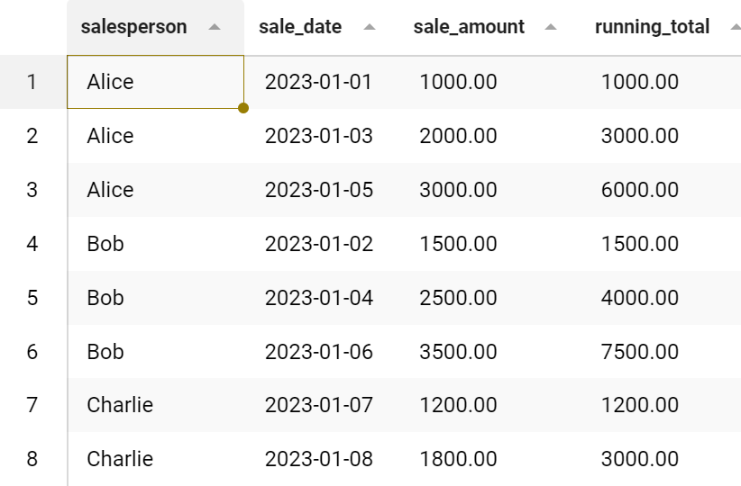

- 为每个销售人员的各自的销售记录分配行号
```sql
SELECT 
    salesperson,
    sale_date,
    sale_amount,
    ROW_NUMBER() OVER (PARTITION BY salesperson ORDER BY sale_date) AS row_num
FROM 
    sales;
```
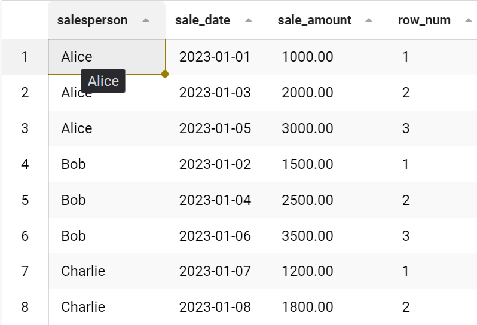

- 计算每个销售人员的自身的销售额排名
```sql
SELECT 
    salesperson,
    sale_date,
    sale_amount,
    RANK() OVER (PARTITION BY salesperson ORDER BY sale_amount DESC) AS the_rank
FROM 
    sales;
```
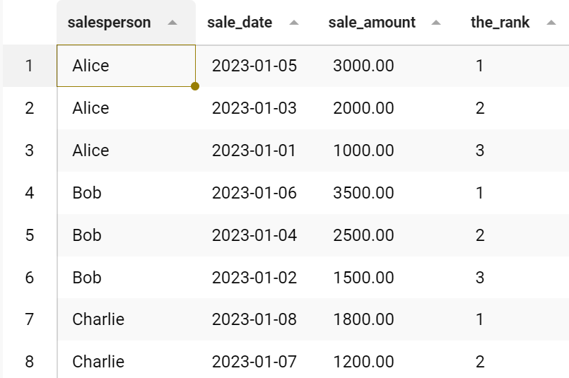

- 计算每个销售人员的各日销售额占自身总体销售额占比
```sql
SELECT 
    salesperson,
    sale_date,
    sale_amount,
    sale_amount / SUM(sale_amount) OVER (PARTITION BY salesperson) * 100 AS sale_percentage
FROM 
    sales;
```
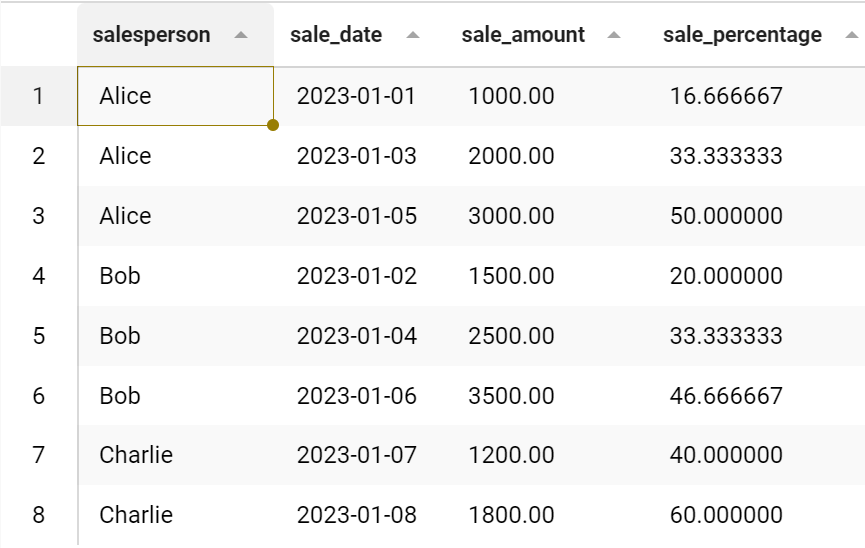

[点击返回目录](#mysql笔记)

> ## 最终章：综合实战

```sql
/*最终实战*/
# 准备数据
CREATE DATABASE test09_sql;
USE test09_sql;

CREATE TABLE employees (
    employee_id INT PRIMARY KEY,
    first_name VARCHAR(50),
    last_name VARCHAR(50),
    department_id INT
);

CREATE TABLE departments (
    department_id INT PRIMARY KEY,
    department_name VARCHAR(50)
);

CREATE TABLE salaries (
    employee_id INT PRIMARY KEY,
    salary DECIMAL(10, 2)
);

CREATE TABLE managers (
    manager_id INT PRIMARY KEY,
    department_id INT
);

-- 插入员工信息
INSERT INTO employees (employee_id, first_name, last_name, department_id)
VALUES
    (1, 'John', 'Doe', 1),
    (2, 'Jane', 'Smith', 2),
    (3, 'Michael', 'Johnson', 1),
    (4, 'Emily', 'Brown', NULL),
    (5, 'David', 'Williams', 3),
    (6, 'Sarah', 'Jones', 1);

-- 插入部门信息
INSERT INTO departments (department_id, department_name)
VALUES
    (1, 'HR'),
    (2, 'Finance'),
    (3, 'IT');

-- 插入员工薪资信息
INSERT INTO salaries (employee_id, salary)
VALUES
    (1, 50000),
    (2, 60000),
    (3, 55000),
    (4, 48000),
    (5, 70000),
    (6, 52000);

-- 插入经理信息
INSERT INTO managers (manager_id, department_id)
VALUES
    (1, 1),
    (2, 2),
    (3, 3);

# 找出每个部门的平均工资
select d.department_id,d.department_name, round(avg(s.salary),2) as avs
from departments as d
left join employees as e on d.department_id=e.department_id
left join salaries as s on e.employee_id=s.employee_id
group by d.department_id;

# 列出每个部门的经理姓名以及它们管理的员工数目
select m.department_id,d.department_name,concat(e.first_name," ",e.last_name) as name,t.num
from managers as m
left join departments as d on d.department_id=m.department_id
left join employees as e on m.manager_id=e.employee_id
left join (select department_id,count(1)-1 as num
           from employees group by department_id) as t
           on t.department_id=m.department_id;

# 列出没有被分配到部门的员工
select * from employees where department_id is null;

# 列出每个部门的员工数目以及该部门的总工资。
select e.department_id,d.department_name,count(1) as num,sum(s.salary) as total
from employees as e
left join salaries as s on s.employee_id=e.employee_id
left join departments as d on d.department_id=e.department_id
group by e.department_id;

# 列出每个员工的名字以及他们的薪资等级（低于平均工资的员工为低级别，高于平均工资的员工为高级别）
set @total_avg_salary = (select avg(salary) from salaries);

select concat(e.first_name," ",e.last_name),s.salary,
round(@total_avg_salary,2) as avs,if(s.salary>@total_avg_salary,'high','low') as level
from employees as e 
left join salaries as s on e.employee_id=s.employee_id;

# 找出薪资排名前3的员工。
select row_number() over(order by s.salary desc) as pos, concat(e.first_name," ",e.last_name) as name,s.salary
from employees as e
left join salaries as s on s.employee_id=e.employee_id limit 3;

# 找出至少有2名员工的部门。
select d.department_id,d.department_name,count(1) as num
from departments as d
left join employees as e on d.department_id=e.department_id
group by d.department_id having count(1)>=2;

# 找出每个部门的平均工资，但排除经理的薪资。
select e.department_id,round(avg(s.salary),2) as avs
from employees as e
left join salaries as s on e.employee_id=s.employee_id
where e.employee_id not in (select manager_id from managers)
group by e.department_id;

# 列出每个部门的员工姓名、薪资，以及该部门内工资排名。
select e.department_id,concat(e.first_name," ",e.last_name) as name,s.salary,
rank() over(partition by e.department_id order by s.salary desc) as inner_rank
from employees as e
left join salaries as s on e.employee_id=s.employee_id;

# 找出每个部门薪资最低的员工
select e.department_id, e.employee_id,
CONCAT(e.first_name, ' ', e.last_name) AS employee_name,s.salary
from employees as e
join salaries as s on e.employee_id=s.employee_id
where s.salary=(
	select min(s1.salary) from employees as e1
  join salaries as s1 on e1.employee_id=s1.employee_id
  where e1.department_id=e.department_id
) and e.department_id is not null;
```